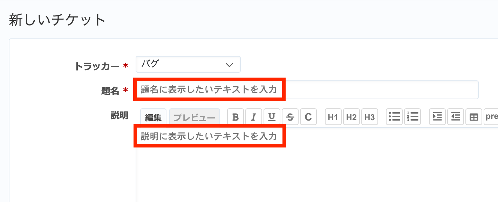

# チケット作成画面で題名・説明に入力例を表示する

新しいチケット作成画面の題名・説明に入力してほしい内容や入力例などを示す薄い灰色のテキストを表示できます。題名・説明にテキストを入力すると薄い灰色のテキストは消えて表示されなくなります。

動作確認バージョン：Redmine 6.0 / RedMica 3.2

## 設定

パスのパターン: `/issues/new`

挿入位置: 全ページのヘッダ

種別: JavaScript

コード:


``` javascript
$(function(){
  $("#issue_subject").attr("placeholder", "題名に表示したいテキストを入力");
  $("#issue_description").attr("placeholder", "説明に表示したいテキストを入力");
});
```

## カスタマイズ結果


