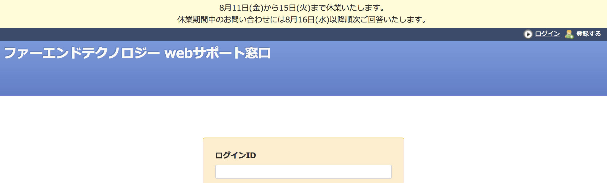

# 全ページの最上部にお知らせを表示する

メンテナンスなど利用者に対する周知事項を目立つように表示できます。

対応バージョン：Redmine 3.4.11, 4.0.4

## 設定

Path Pattern: `/`

Type: JavaScript

Code:

``` javascript
/* 全ページの最上部にお知らせを表示する */
$(function() {
  $('div#wrapper').before(
    '<div style="text-align: center; padding: 4px 0; background: #ffffcd;">' +
    'MM月DD日からDD日まで休業いたします。<br>' +
    '休業期間中のお問い合わせにはMM月DD日以降順次ご回答いたします。' +
    '</div>'
  );
});
```

## カスタマイズ結果


