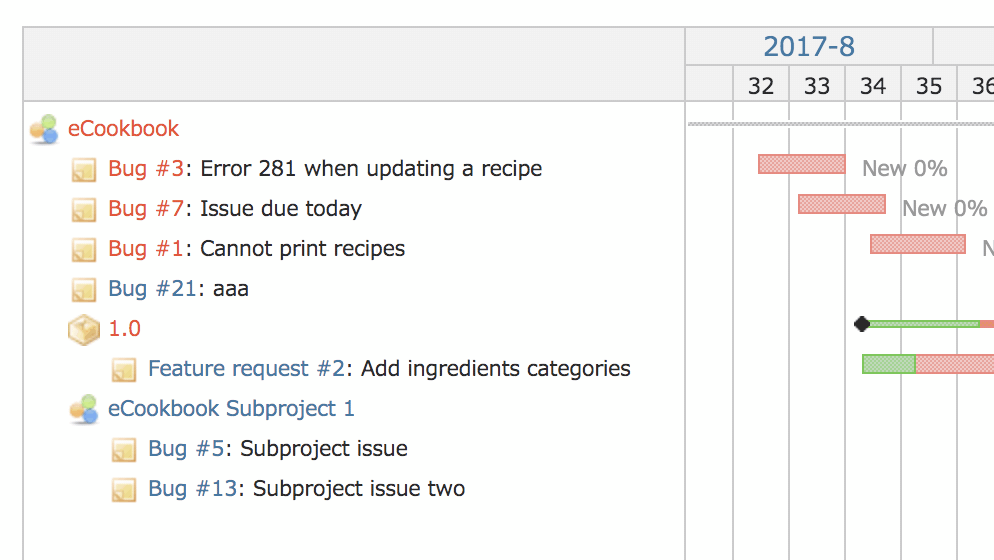
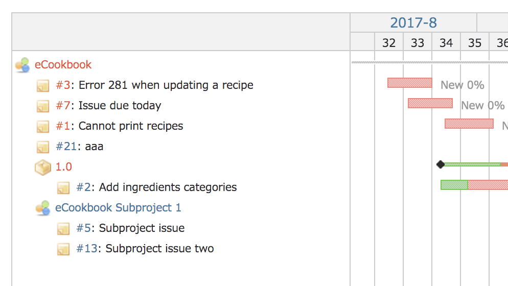

# ガントチャートでトラッカー名を非表示にする

ガントチャートでのチケットの件名の表示は、「トラッカー名 #999: 題名」というスタイルになっています。トラッカーの表示を削除して「#999: 題名」という形式にすることができます。トラッカー名を重視していない運用を行っている場合、トラッカー名を表示しないことで、チケットの題名をより長く表示することができるようになります。

動作確認バージョン：Redmine 6.0 / RedMica 3.2


## 設定

パスのパターン: `/issues/gantt`

挿入位置: 全ページのヘッダ

種別: JavaScript

コード:

``` javascript
/* ガントチャートでトラッカー名を表示しない */
$(function() {
  $('div.gantt_subjects a.issue').each(
    function(i, elm) {
      $(elm).text($(elm).text().replace(/^.* /, ''));
    }
  );
});
```

## カスタマイズ結果

### カスタマイズ前



### カスタマイズ後



