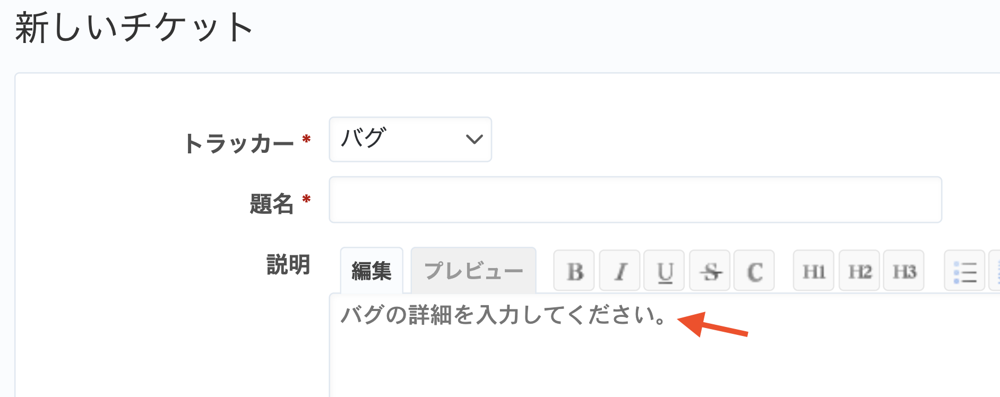

# チケット作成・編集画面でトラッカーに応じて説明欄に入力例を表示する

説明欄に入力してほしい内容や入力例などを示す薄い灰色のテキストを表示できます(カスタマイズ結果の画像をご覧ください)。  
説明欄に何かを入力した後は薄い灰色のテキストは消えて表示されなくなります。

動作確認バージョン：Redmine 6.0 / RedMica 3.2

## 設定

パスのパターン: `/issues/`

挿入位置: チケット入力欄の下

種別: JavaScript

コード:


``` javascript
/* トラッカーに応じて説明欄に入力例などを表示する */
$(function() {
  function setPlaceholder(){
    if(!$("#issue-form").length){
      return;
    }
    var placeholder = "";
    var tracker_id = 0;
    if($("#issue_tracker_id").length){
      tracker_id = parseInt($("#issue_tracker_id").val(), 10);
    }
    switch(tracker_id){
    case 1:
      placeholder = "トラッカー1のplaceholder";
      break;
    case 2:
      placeholder = "トラッカー2のplaceholder";
      break;
    case 3:
      placeholder = "トラッカー3のplaceholder";
      break;
    }
    $("#issue_description").attr("placeholder", placeholder);
  }
  setPlaceholder();
});

```

**※Redmineの設定に合わせてコード内にある次の値を変更してカスタマイズを作成してください。**

* case 数字の値  
「case」の後の1,2などの数字は使用しているトラッカーに合わせて変えてください。  
（トラッカーの値を確認する方法：上部メニュー[管理]→[トラッカー]→トラッカーの名称をクリックして表示される画面のURLから確認できます。）
* placeholderの値  
「トラッカー1のplaceholder」「トラッカー2のplaceholder」はトラッカーごとに説明欄へ表示したい内容に変えてください。


## カスタマイズ結果

