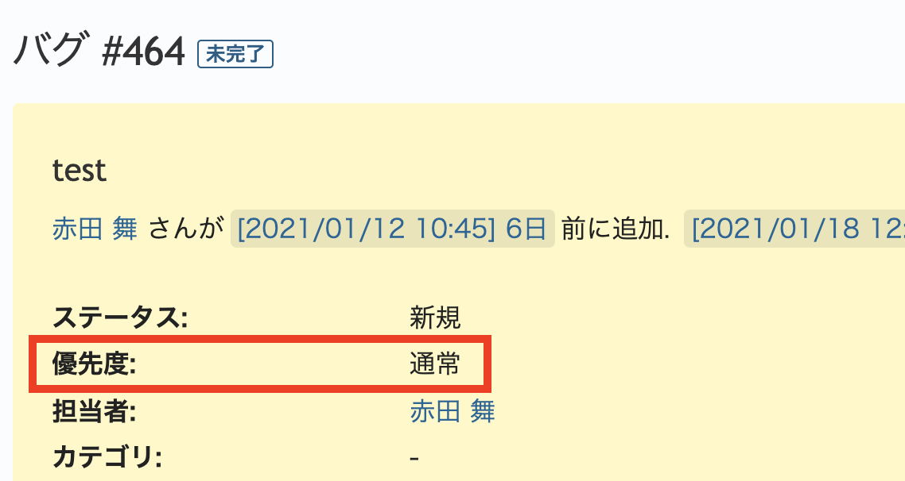
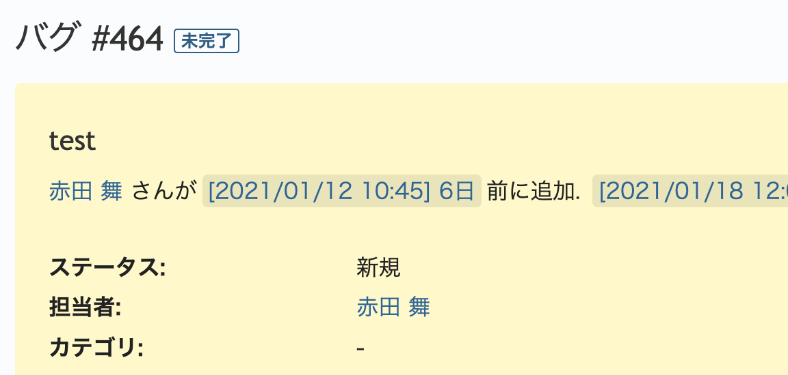

# チケットの表示画面で「優先度」を非表示にする

> [!TIP]  
> Redmineの標準機能で、「優先度」を非表示に設定できます。この機能を利用することで、ここで紹介しているView Customizeによるカスタマイズは不要です。  
>
> Redmine 5.1からトラッカーごとに「優先度」を無効化できるようになりました。  
> 詳細:[https://redmine.jp/faq/issue/disable-priority/](https://redmine.jp/faq/issue/disable-priority/)

上部メニュー「管理」→「ワークフロー」→「フィールドに対する権限」で「優先度」を読み取り専用にするとチケットの作成・編集画面には優先度を選択するためのドロップダウンが表示されなくなります。  
以下のカスタマイズでは、チケットの表示画面での「優先度」を非表示にします。

対応バージョン：Redmine 3.4.11 / RedMica 1.2.0

## 設定

パスのパターン: `/issues/[0-9]+$`

挿入位置: 全ページのヘッダ

種別: CSS

コード:

~~~ css
div.attributes div.splitcontent div.priority.attribute{
  display:none;
}
~~~

## カスタマイズ結果

### カスタマイズ前

### カスタマイズ後

