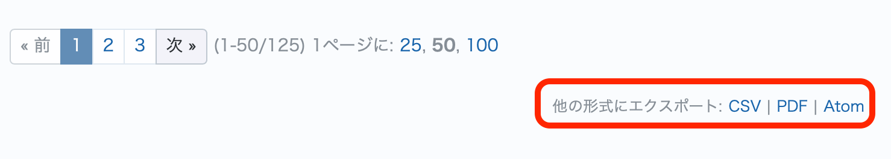
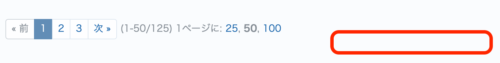

# チケット一覧およびチケット画面でシステム管理者以外には「他の形式にエクスポート」リンクを非表示にする

チケット一覧下部にある「他の形式にエクスポート」リンクをシステム管理者以外には非表示にします。なお、非表示にしているだけであり、権限を有するユーザーはエクスポートすることが可能です。

動作確認バージョン：Redmine 6.1 / RedMica 4.0

## 設定

パスのパターン: `/issues\??.*$`  
※ `/issues` または `/issues?` にマッチ (いずれもチケット一覧画面のURL)

挿入位置: 全ページのヘッダ

種別: JavaScript

コード:

``` css
window.addEventListener('load', () => {
  if (!ViewCustomize.context.user.admin) {
    document.querySelector('p.other-formats')?.remove();
  }
});
```

## カスタマイズ結果

### カスタマイズ前



### カスタマイズ後


