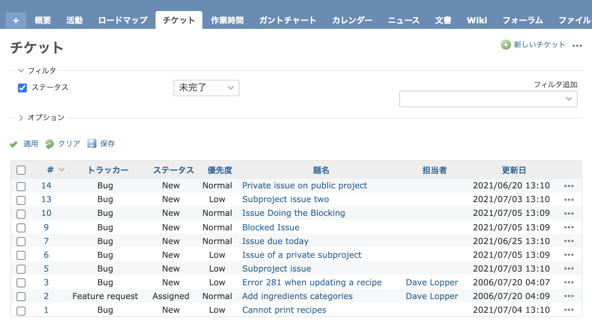
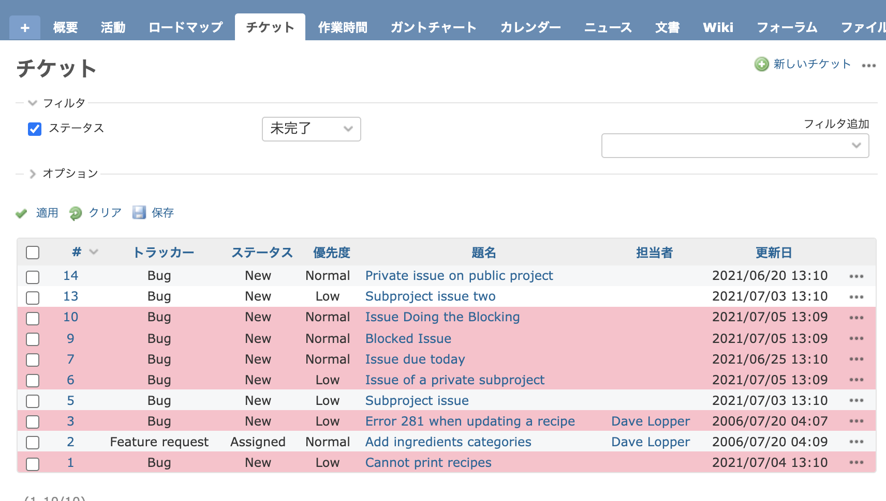

# チケット一覧で期日が過ぎたチケットの背景色を変更する

期日が過ぎたチケットの背景色を変えて目立つようにするカスタマイズです。

[farend bleuclair](https://github.com/farend/redmine_theme_farend_bleuclair), [farend_basic](https://github.com/farend/redmine_theme_farend_basic), [farend_fancy](https://github.com/farend/redmine_theme_farend_fancy)などのテーマを利用するとカスタマイズを追加せずにテーマで設定されている色で優先度ごとに色分け表示されます。

対応バージョン：Redmine 4.2.1 / RedMica 1.2.0

## 設定

パスのパターン: `/issues$`

挿入位置: 全ページのヘッダ

種別: CSS

コード:

``` css
table.list > tbody > tr.overdue:not(:hover) { background-color: pink; }
```

background-colorは任意の色に変更ください。

## カスタマイズ結果

### カスタマイズ前



### カスタマイズ後



