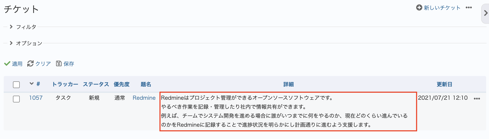
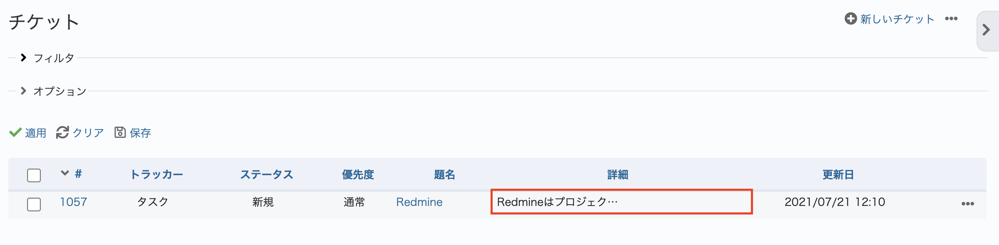

# チケット一覧で長いテキストのカスタムフィールドの値を省略して表示する

長いテキストの項目を複数行入力している時、チケット一覧画面で長いテキストの項目を表示すると複数行に渡って内容が表示されます。
以下のカスタマイズでは表示される長いテキスト複数行のを1行目の数文字を表示するようにして、チケット一覧で1つのチケットが表示範囲を少なくします。

動作確認バージョン：Redmine 6.0 / RedMica 3.2

## 設定

パスのパターン: `/issues`

挿入位置: 全ページのヘッダ

種別: CSS

コード:

``` css
table.list.issues td.text.cf_[カスタムフィールドのID] p {display: none;}
table.list.issues td.text.cf_[カスタムフィールドのID] p br {display: none;}
table.list.issues td.text.cf_[カスタムフィールドのID] p:first-child {
  display: inline-block;
  white-space: nowrap;
  overflow: hidden;
  text-overflow: ellipsis;
  width: 12em;  /* 幅は変更して調整ください */
}
```

カスタムフィールドのIDは、カスタムフィールドの設定画面のURLから調べることができます。  
カスタムフィールドのIDの確認方法：上部メニュー「管理」→ 「カスタムフィールド」→ 長いテキストのカスタムフィールドをクリック → URLを確認  
例）URLが`https://example.cloud.redmine.jp/custom_fields/111/edit`の場合、111がカスタムフィールドのIDです。`table.list.issues td.text.cf_111`のようにコードにIDを追加します。
　

## カスタマイズ結果

### カスタマイズ前



### カスタマイズ後



