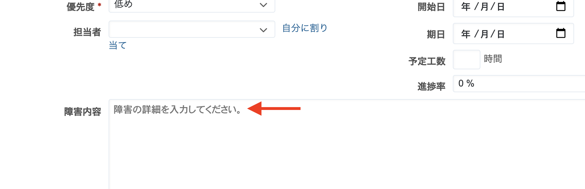

# テキスト形式のカスタムフィールド欄に入力例を表示する

> [!TIP]  
> Redmineの標準機能で、カスタムフィールドにプレースホルダを表示することが可能です。この機能を利用することで、ここで紹介しているView Customizeによるカスタマイズは不要です。  
>
> Redmine 5.0からカスタムフィールドの「説明」に設定された内容がチケットの作成画面のプレースホルダとして表示されるようになりました。  
> 詳細:[https://blog.redmine.jp/articles/5_0/new-features/#14275](https://blog.redmine.jp/articles/5_0/new-features/#14275)

テキスト形式や長いテキスト形式のカスタムフィールドに入力してほしい内容や入力例などを示す薄い灰色のテキストを表示できます
カスタムフィールドに何かを入力した後は薄い灰色のテキストは消えて表示されなくなります。

対応バージョン：RedMica 1.3

## 設定

パスのパターン: `/issues/`

挿入位置: チケット入力欄の下

種別: JavaScript

コード:

``` javascript
$(function(){
  $("#issue_custom_field_values_[カスタムフィールドID]").attr("placeholder", "表示したい内容");
});
```

**※入力例を表示したいカスタムフィールドID以下の手順で確認して指定してください**

1. 上部メニュー[管理]→[カスタムフィールド]
2. カスタムフィールドの名称をクリックして表示される画面のURLから確認できます

## カスタマイズ結果

