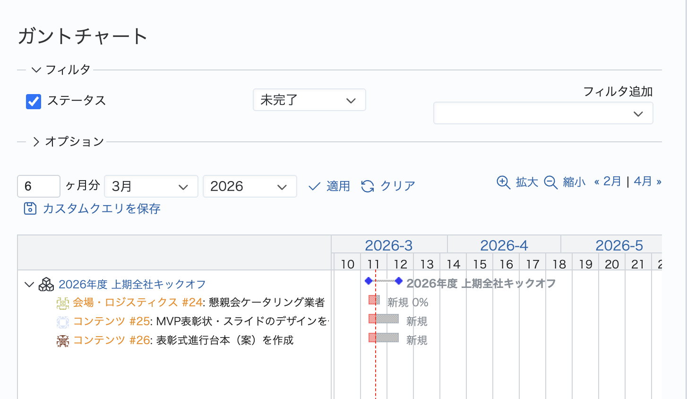
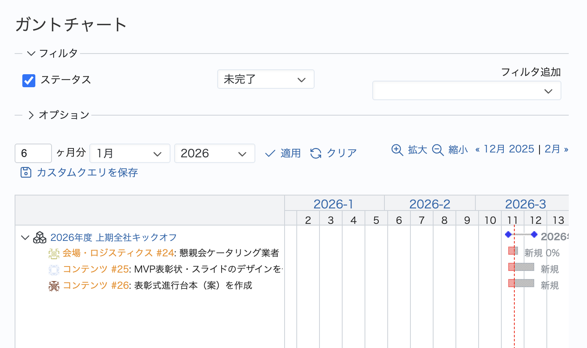

# ガントチャートの開始月を変更する

標準では当月から表示される開始月を変更して表示します。  
このカスタマイズでは2ヶ月前から表示します。

対応バージョン：Redmine 6.1.1 / RedMica 4.0.3

## 設定

パスのパターン: `/issues/gantt`

挿入位置: 全ページの末尾

種別: JavaScript

コード:

``` javascript
$(function() {
    var params = new URLSearchParams(window.location.search);
    if (!params.has('year') && !params.has('month')) {
        var targetDate = new Date();
        // 2ヶ月前の日付をセット
        targetDate.setMonth(targetDate.getMonth() - 2);

        var targetYear = targetDate.getFullYear();
        var targetMonth = targetDate.getMonth() + 1;

        params.set('year', targetYear);
        params.set('month', targetMonth);

        var newUrl = window.location.pathname + '?' + params.toString();
        window.location.replace(newUrl);
    }
});
```

## カスタマイズ結果
## カスタマイズ前

## カスタマイズ後
