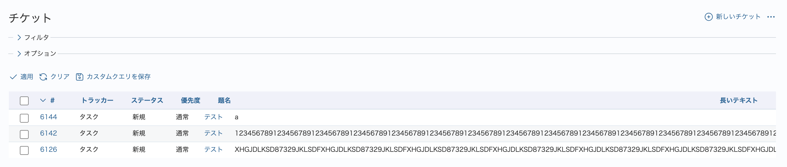
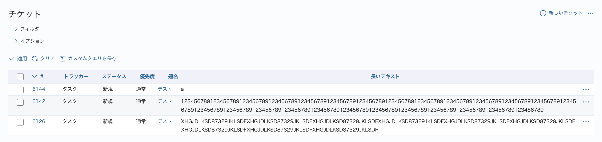

# チケット一覧で見切れる「長いテキスト」形式カスタムフィールドの値を改行して表示する

「長いテキスト」形式のカスタムフィールドに英字や数字を含む長い文字列が入力されていると、チケット一覧で項目の幅が広がり、値が見切れてしまうことがあります。  
このカスタマイズでは、CSSの overflow-wrap プロパティを適用し、長い文字列を改行して表示するようにします。

対応バージョン：RedMica 3.1

## 設定

パスのパターン: `/issues$`

挿入位置: 全ページのヘッダ

種別: CSS

コード:

``` css
/* チケット一覧で見切れる「長いテキスト」形式カスタムフィールドの値を改行して表示する */
table.list.issues td.text.cf_スタムフィールドのID {
  overflow-wrap: anywhere;
}
```

カスタムフィールドのIDは、カスタムフィールドの設定画面のURLから調べることができます。  
カスタムフィールドのIDの確認方法：トップメニュー「管理」→ 「カスタムフィールド」→ 長いテキストのカスタムフィールドをクリック → URLを確認  
例）URLが`https://example.cloud.redmine.jp/custom_fields/111/edit`の場合、111がカスタムフィールドのIDです。`table.list.issues td.text.cf_111`のようにコードにIDを追加します。

## カスタマイズ結果

#### カスタマイズ前



#### カスタマイズ後


