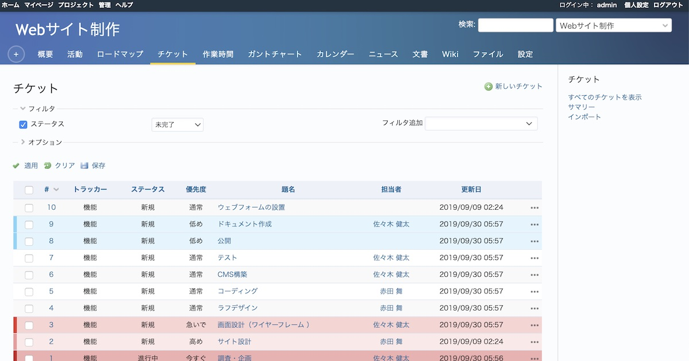
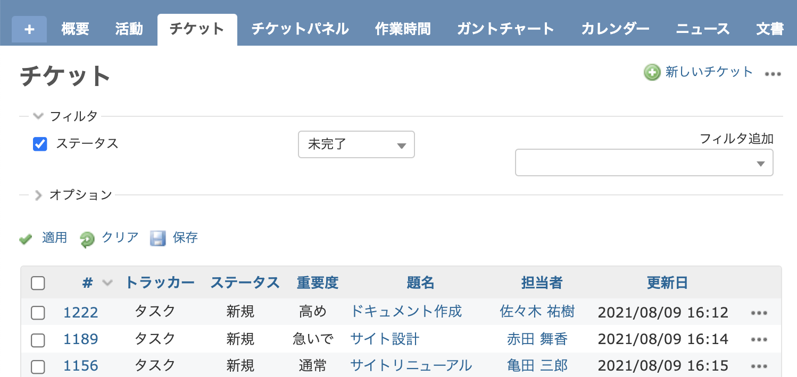
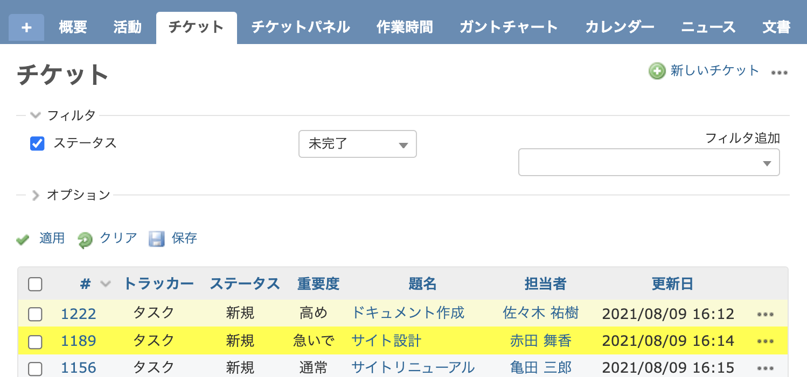

# チケット一覧で優先度によってチケットの背景色を変更する

チケット一覧でチケットの背景色を優先度別に変更するカスタマイズです。

[farend bleuclair](https://github.com/farend/redmine_theme_farend_bleuclair), [farend_basic](https://github.com/farend/redmine_theme_farend_basic), [farend_fancy](https://github.com/farend/redmine_theme_farend_fancy)などのテーマを利用するとカスタマイズを追加せずにテーマで設定されている色で優先度ごとに色分け表示されます。

テーマ「farend bleuclair」適用したチケット一覧



対応バージョン：Redmine 4.1.1 / RedMica 1.2.0

## 設定

パスのパターン: `/issues$`

挿入位置: 全ページのヘッダ

種別: CSS

コード:

``` css

table.list.issues tbody tr.priority-3 {
  background-color: #fffacd;
}

table.list.issues tbody tr.priority-4 {
  background-color: #ffff00;
}
```

priority-3 や priority-4 の数字部分が優先度を特定するID番号です。背景色を変更したい優先度のIDに置き変えてください。IDはチケット表示画面のHTML内をご覧いただくか、もしくは優先度の編集画面（管理→選択肢の値→優先度の名称をクリック）のURLに含まれる数字で確認できます。
　

## カスタマイズ結果

### カスタマイズ前



### カスタマイズ後



