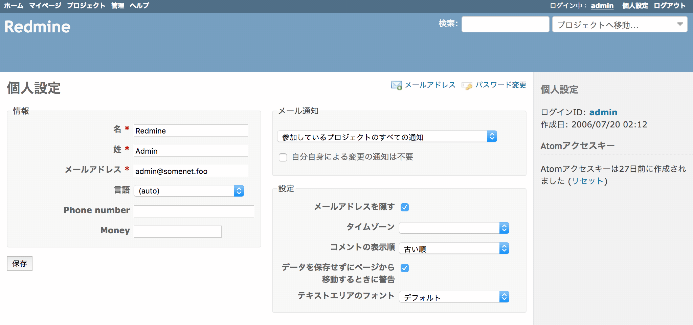
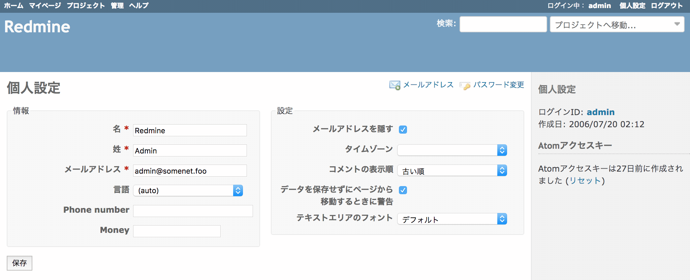

# 「個人設定」画面内の「メール通知」を非表示にする

「個人設定」にある「メール通知」を非表示にし、ユーザーによる変更をできないようにします。

動作確認バージョン：Redmine 6.0 / RedMica 3.2

## 設定

パスのパターン: `/my/account`

挿入位置: 全ページのヘッダ

種別: CSS

コード:

``` css
/* 「個人設定」画面内の「メール通知」を非表示にする */
.controller-my.action-account .splitcontentright .box:first-child {
  display: none;
}
```

## カスタマイズ結果

### カスタマイズ前




### カスタマイズ後

