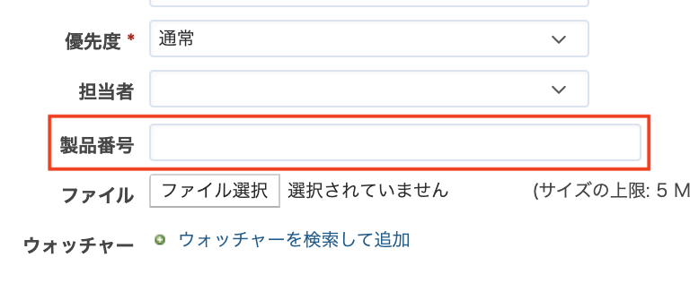
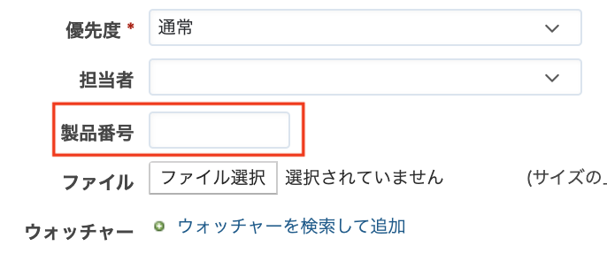

# カスタムフィールドの幅を変更する

カスタムフィールドの幅を変更してチケットの作成画面や編集画面で表示します。

対応バージョン: Redmine 3.4.11, 4.0.5, 4.1.0

## 設定

パスのパターン: `/issues`

挿入位置: チケット入力欄の下

種別: CSS

コード:

``` css
/* テキスト形式(テキスト形式)の幅を100pxに変更する */
input#issue_custom_field_values_カスタムフィールドの値 {
  width: 100px; 
}
``` 


### 「カスタムフィールドの値」確認方法

**方法①**  
「管理」→「カスタムフィールド」→カスタムフィールドの名称をクリック→URLから確認できます。  
例）`http://localhost:3000/custom_fields/1/edit`

**方法②**  
チケット作成画面のHTMLのソースをブラウザで表示させると確認できます。

``` html
<p><label for="issue_custom_field_values_1"><span>製品番号</span></label><input type="text" name="issue[custom_field_values][1]" id="issue_custom_field_values_1" value="" class="string_cf" /></p>
``` 

## カスタマイズ結果

「製品番号」がカスタムフィールドです。

### カスタマイズ前



### カスタマイズ後


