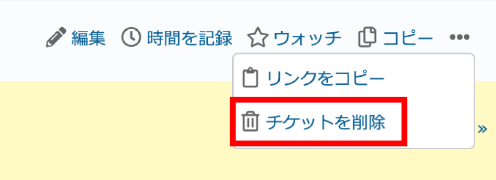
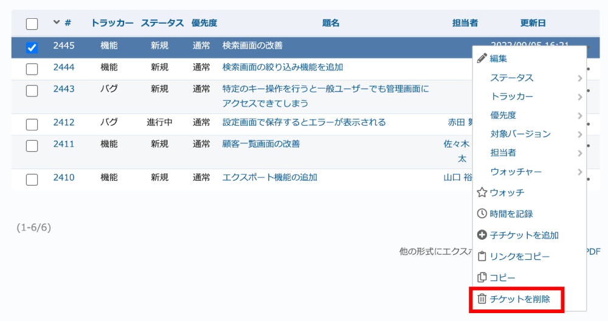
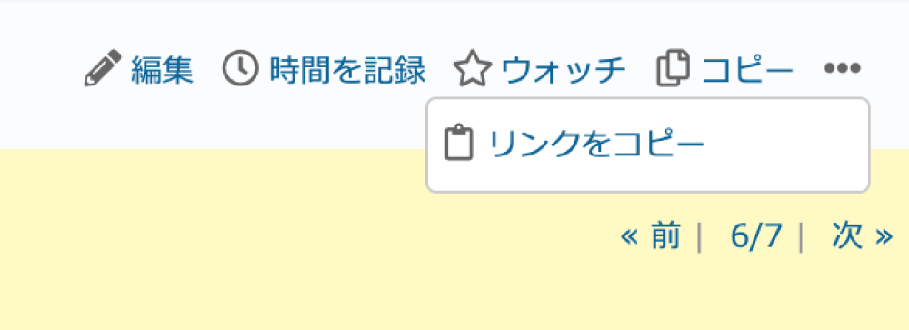
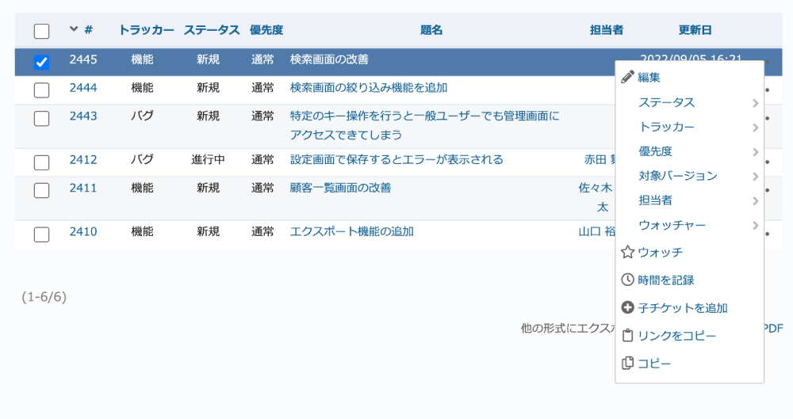

# システム管理者権限ユーザーでログインした際にチケット削除ボタンを非表示にする

システム権限を持つユーザーに対しては、チケットの削除権限の設定は反映されません。システム管理者権限を持つユーザーがログインした際も、チケットの削除が行えないよう削除ボタンを非表示にします。

動作確認バージョン：Redmine 6.0 / RedMica 3.2

## 設定

### 設定1: チケット画面の「チケットを削除」を非表示にする

パスのパターン: `/issues/[0-9]+`

挿入位置: 全ページのヘッダ

種別: CSS

コード:

~~~ css
div.contextual a[data-method="delete"]{
  display: none;
}
~~~

### 設定2: コンテキストメニューの「チケットを削除」を非表示にする

チケット一覧、マイページ、ロードマップ、バージョン、ガントチャート、カレンダーなどのコンテキストメニューから非表示にします。

パスのパターン: `/`

挿入位置: 全ページのヘッダ

種別: CSS

コード:

~~~ css
body.controller-issues.action-index div#context-menu a[data-method="delete"],
body.controller-my.action-page div#context-menu a[data-method="delete"],
body.controller-versions.action-index div#context-menu a[data-method="delete"],
body.controller-versions.action-show div#context-menu a[data-method="delete"],
body.controller-gantts.action-show div#context-menu a[data-method="delete"],
body.controller-calendars.action-show div#context-menu a[data-method="delete"],
body.controller-issues_panel.action-index div#context-menu a[data-method="delete"]
{
  display: none;
}
~~~

## カスタマイズ結果

### カスタマイズ前

|設定1: チケット画面|設定2: チケット一覧画面|
|---|---|
|||

### カスタマイズ後

|設定1: チケット画面|設定2: チケット一覧画面|
|---|---|
|||
