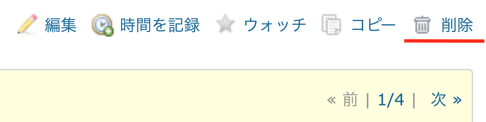
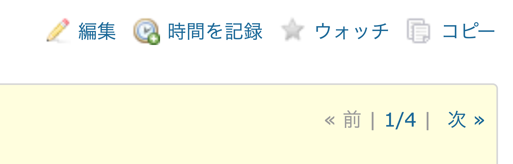

# システム管理者権限ユーザーでログインした際にチケット削除ボタンを非表示にする

システム権限を持つユーザーに対しては、チケットの削除権限の設定は反映されません。システム管理者権限を持つユーザーがログインした際も、チケットの削除が行えないよう削除ボタンを非表示にします。

対応バージョン：Redmine 3.4.11, 4.0.4, 4.1.0

## 設定

パスのパターン: `/`

挿入位置: 全ページのヘッダ

種別: CSS

コード:

~~~ css
/*チケット編集画面の削除ボタンを非表示*/	
div.contextual a.icon.icon-del{
  display: none;
}

/*チケット一覧の右クリックメニューでの削除ボタンを非表示*/
div#context-menu li:last-child {
  display:none;
}
~~~

## カスタマイズ結果

### カスタマイズ前

### カスタマイズ後

