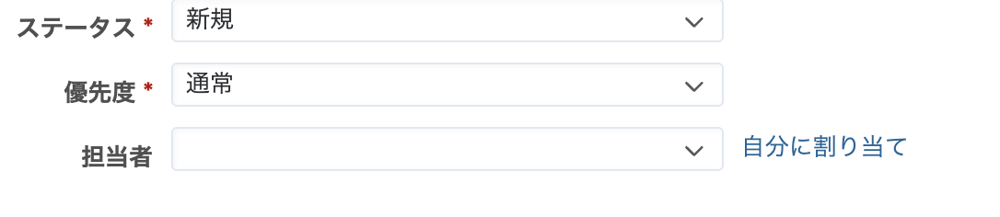
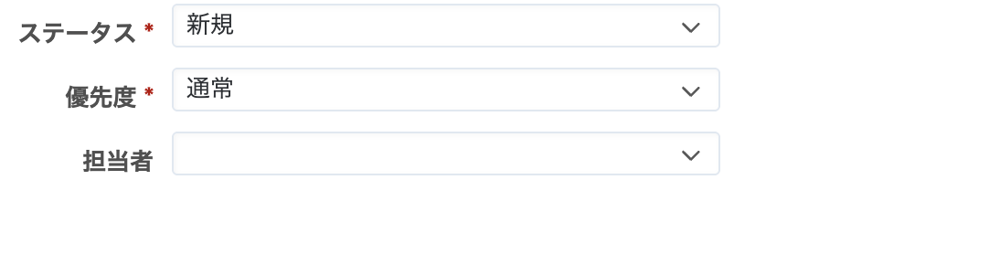

# チケット作成・編集画面で担当者欄の「自分に割り当て」を非表示にする

担当者欄に表示される「自分に割り当て」を非表示にします。

> [!Caution]
> * 画面上から非表示となっているだけのため、「自分に割り当て」が表示されていた箇所をクリックすると「<<自分>>」が選択されます
> * 担当者を選択するプルダウンには「<<自分>>」は表示されます

対応バージョン：RedMica 3.1.7

## 設定

パスのパターン: `/issues/`

挿入位置: 全ページのヘッダ

種別: CSS

コード:

``` css
a.assign-to-me-link {
  color: transparent;
  cursor: default;
}
```

## カスタマイズ結果

### カスタマイズ前



### カスタマイズ後

