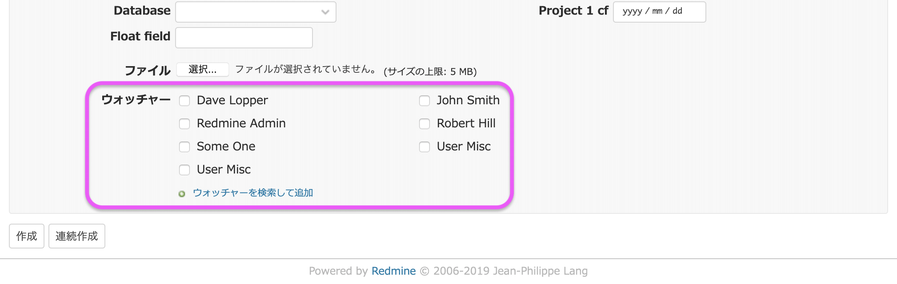
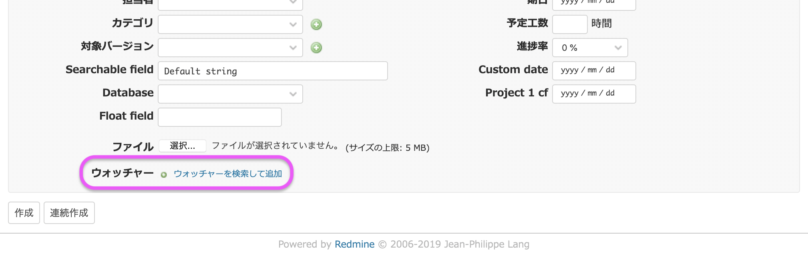

# チケット作成画面の「ウォッチャー」欄でメンバーの表示を行わず必ず「ウォッチャーを検索して追加」を使用するようにする

「ウォッチャーの追加」権限がある場合、チケット作成画面にはウォッチャーを選択するための「ウォッチャー」欄が表示され、そこには最大20件のメンバーが表示されます。そこに表示がないメンバーを追加する場合は「ウォッチャーを検索して追加」をクリックしてダイアログボックスから追加します。

このカスタマイズはウォッチャー欄を表示させず、必ず「ウォッチャーを検索して追加」からウォッチャーを追加するようにします。

対応バージョン: Redmine 4.0.5


## 設定

パスのパターン: `/issues/gantt`

挿入位置: チケット入力欄の下

種別: CSS

コード:

``` css
span#watchers_inputs { display: none; }
```

## カスタマイズ結果

### カスタマイズ前



### カスタマイズ後

