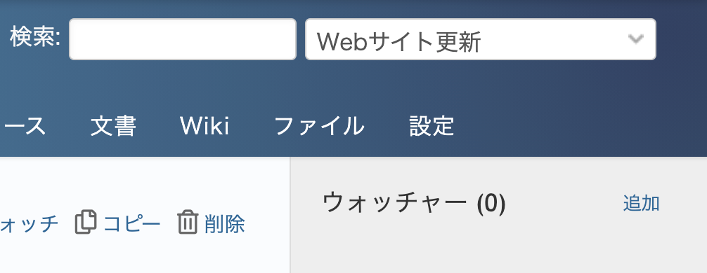
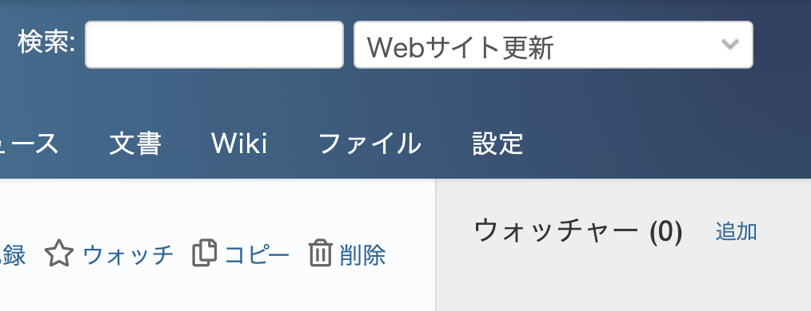

# サイドバーの幅を狭くする

> [!TIP]  
> Redmine 6.0からデフォルトテーマでサイドバーの表示・非表示の切り替えができるようになりました。  
> 詳細:[https://blog.redmine.jp/articles/6_0/new-features/#21808](https://blog.redmine.jp/articles/6_0/new-features/#21808)

ウォッチャーやカスタムクエリなどが表示される右側のサイドバーを変更して表示します。

動作確認バージョン：Redmine 6.0 / RedMica 3.2

## 設定

パスのパターン: `.*`

挿入位置: 全ページのヘッダ

種別: CSS

コード:

``` css
div#sidebar {
  width: 15%;
}
```
コメント: サイドバーを狭くする

## カスタマイズ結果
### カスタマイズ前


### カスタマイズ後
