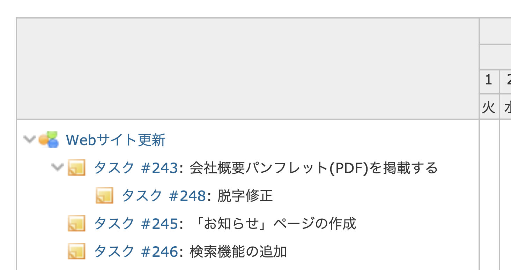
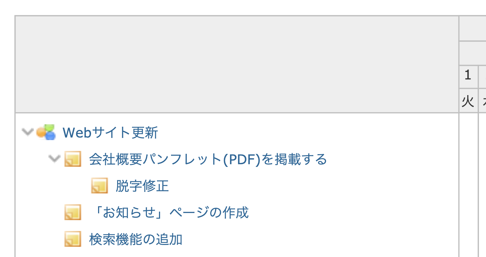

# ガントチャートでトラッカー名・チケット番号をを非表示にする

ガントチャートでのチケットの件名の表示は、「トラッカー名 #999: 題名」というスタイルになっています。トラッカーとチケット番号を削除して題名のみの形式にすることができます。題名をチケットへのリンクにしています。  
トラッカー・チケット番号を重視していない運用を行っている場合、非表示にしてチケットの題名をより長く表示できます。  


対応バージョン：Redmine 4.1.0


## 設定

パスのパターン: `/issues/gantt`

挿入位置: 全ページのヘッダ

種別: JavaScript

コード:

``` javascript
/* ガントチャートでトラッカー名・チケット番号を表示しない */
$(function() {
  $('div.issue-subject span a.issue').text('');
  $('div.issue-subject span').each(function(){
    var issue_subject = $(this).text();
    var old_html = $(this).html();
    $(this).html(old_html.replace(issue_subject, ''));
    $(this).find('a.issue').text(issue_subject.slice(2));
  });
});
```

## カスタマイズ結果

### カスタマイズ前



### カスタマイズ後



