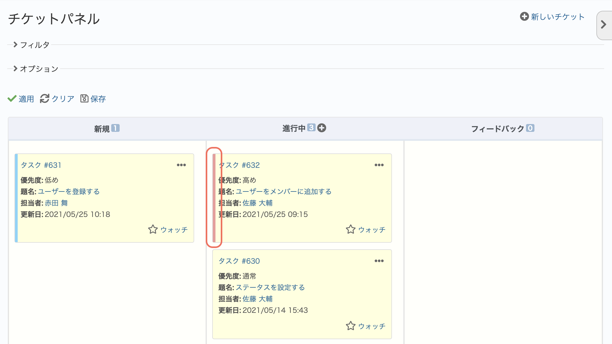
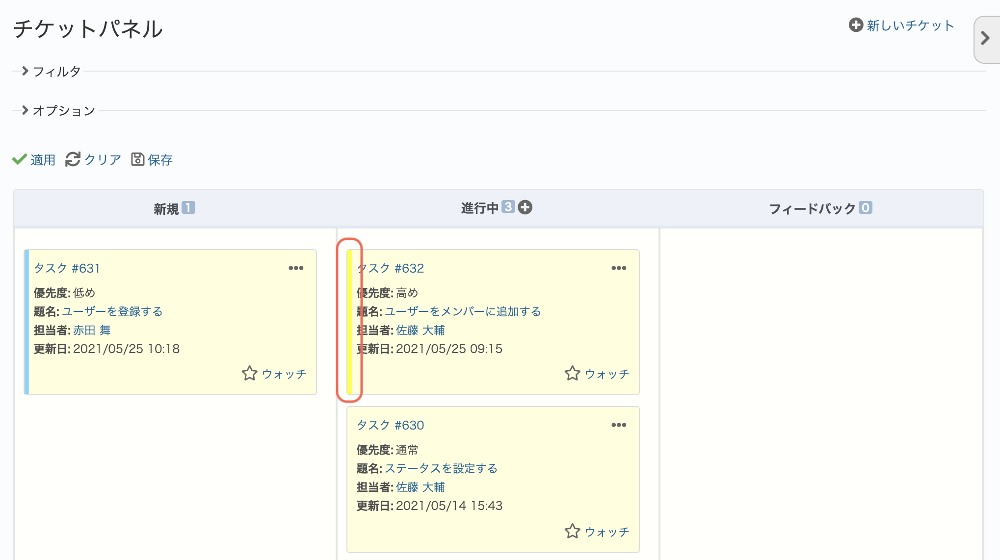

# チケットパネルのカードの左側に表示される色を変更する

> [!Note]  
> 「チケットパネル」とは、チケット一覧をカード形式でかんばん風に表示するプラグインです。  
> 詳細:[https://github.com/redmica/redmine_issues_panel](https://github.com/redmica/redmine_issues_panel)

チケットパネルでは優先度によってカード形式のチケットの左側に色が表示されます。  
以下のカスタマイズでは、表示される色を好きな色に変更します。

動作確認バージョン：Redmine 6.0 / RedMica 3.2

## 設定

パスのパターン: `/issues_panel`

挿入位置: 全ページのヘッダ

種別: CSS

コード:

~~~ css
div.issue-card div.priority-3 {
  box-shadow: 4px 0px 0px 0px #ffff00 inset;
}
~~~

各チケットのカードの要素には、優先度によって`priority-1`、`priority-2`など、ID番号がついたクラス名がついています。このID番号がついたクラス名をごとに色を指定できます。  
色は`#ffff00`のようにカラーコードで指定します。上記の設定では黄色を指定しています。

## カスタマイズ結果

### カスタマイズ前

### カスタマイズ後

