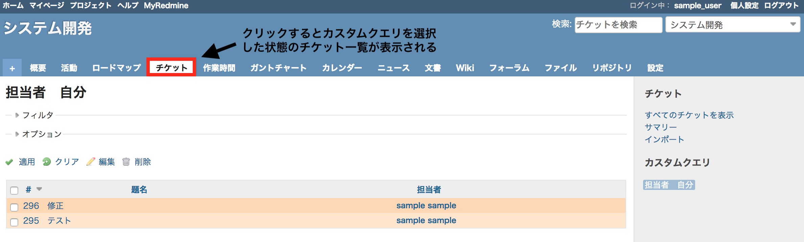

# カスタムクエリが反映されたチケット一覧画面を表示する

> [!TIP]  
> Redmineの標準機能で、チケットの一覧画面にデフォルトのカスタムクエリを設定できます。デフォルトのカスタムクエリを設定することで、View Customize によるカスタマイズは不要です。
> 
> Redmine 5.0以降ではチケット一覧画面を開いたときにデフォルトで表示するカスタムクエリを設定できるようになりました。  
> デフォルトクエリ設定後は、カスタムクエリが自動的に適用されます。  
> 詳細:[https://blog.redmine.jp/articles/5_0/new-features/#7360](https://blog.redmine.jp/articles/5_0/new-features/#7360)

チケット一覧では「ステータス」が「未完了」のチケットがデフォルトで表示されます。  
特定プロジェクトのチケット一覧へのリンク先を、カスタムクエリを適用したチケット一覧のURLに設定して表示します。  
※カスタムクエリを表示するユーザーを「すべてのユーザー」に設定する必要があります。

対応バージョン: Redmine 3.4.11, 4.0.7, 4.1.1

## 設定

パスのパターン: `/projects/プロジェクト識別子`

挿入位置: 全ページのヘッダ

種別: JavaScript

コード:

``` javascript
$(function(){
  var tab = $('div#main-menu a.issues');
  if(tab.length){
    tab.attr('href', tab.attr('href') + '?query_id=****');
  }
});
```

「****」は表示したいカスタムクエリのIDに書き換えてください。IDはカスタムクエリを表示したURLから調べることができます。  
プロジェクト識別子の確認方法：プロジェクトの「設定」→ 画面内「識別子」  

## カスタマイズ結果




