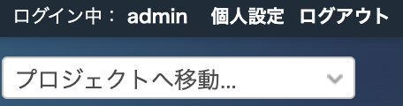
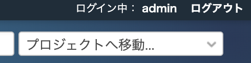

# 「個人設定」を非表示にする

ログイン後、画面右上に表示される「個人設定」を非表示します。  
※操作している限り個人設定は見えませんが、 **HTMLのソースコードには残っています** 。

対応バージョン：Redmine 3.4.11, 4.0.5, 4.1.0

## 設定

パスのパターン: `.*`

種別: CSS

挿入位置: 全ページのヘッダ

``` css
/* 「個人設定」を非表示にする */
#top-menu a.my-account {
  display: none;
}
```

## カスタマイズ結果

### カスタマイズ前



### カスタマイズ後


