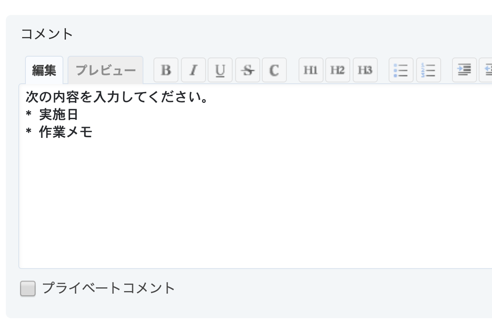

# チケットのコメント入力欄にテンプレートを追加する

> [!TIP]
> コメント欄へのテンプレート追加は、[Redmine Issue Templates Plugin](https://github.com/agileware-jp/redmine_issue_templates)でも実現可能です。  
> Redmine Issue Templates Pluginの利用方法を紹介した記事: [https://blog.redmine.jp/articles/how-to-use-issue-templates-plugin/](https://blog.redmine.jp/articles/how-to-use-issue-templates-plugin/)

チケットの編集時にコメントの入力欄にテンプレート（文言）表示します。

対応バージョン: Redmine 3.4.11, 4.0.5, 4.1.0

## 設定

パスのパターン: `/issues/[0-9]+$`

挿入位置: チケット詳細の下

種別: JavaScript

コード:

``` javascript
$(function(){
  // コメント入力欄の文言設定
  document.getElementById( "issue_notes" ).value = "次の内容を入力してください\。\n* 実施日\n* 作業メモ";
});
```

## カスタマイズ結果

チケットの「編集」ボタンをクリックすると、コメントの入力欄に設定した文言が表示されます。

### カスタマイズ後


