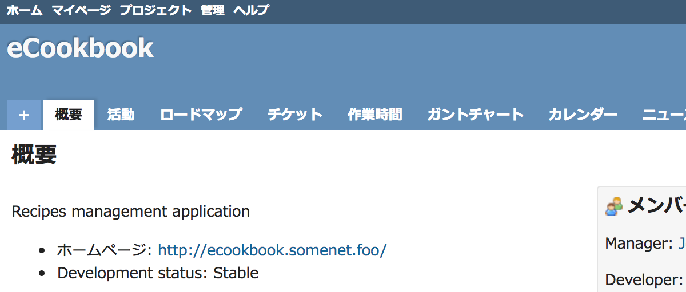

# ヘッダの背景色を変更する

複数のRedmineを運用しているとき、それぞれのヘッダの色を別のものに変更して識別しやすくすれば、各Redmineの取り違えやそれによる誤操作を防ぐことができます。

動作確認バージョン：Redmine 6.0 / RedMica 3.2

## 設定

パスのパターン: `/`

挿入位置: 全ページのヘッダ

種別: CSS

コード:

``` css
/* ヘッダの背景色を変更する */

/* ヘッダの背景色 */
#header {
  background: #59b36b;
}
/* +ボタンとホバーしているタブの背景色 */
#main-menu li a.new-object, #main-menu li a:hover {
  background: #8fcc9b;
}
```

## カスタマイズ結果

### カスタマイズ前



### カスタマイズ後


