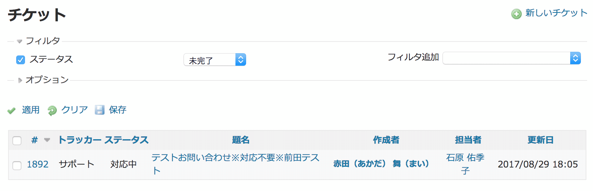
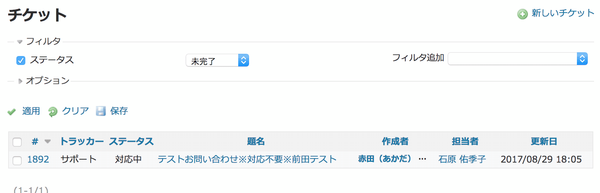

# チケット一覧で作成者・担当者・最終更新者の名前が折り返されないようにする


チケット一覧でユーザーの名前が不自然な位置で改行されることがあります。原則として改行せずに表示し、一定の幅に収まらない名前は後ろを切って … で表示されるようにします。

対応バージョン：Redmine 3.4.11, 4.0.4

## 設定

Path Pattern: `/issues\??.*$`<br>
※ `/issues` または `/issues?` にマッチ (いずれもチケット一覧画面のURL)

Type: Stylesheet

Code:

``` css
/* チケット一覧で担当者、更新者、最終更新者を折り返さない */
table.list.issues td.author,
table.list.issues td.assigned_to,
table.list.issues td.last_updated_by {
  white-space: nowrap;
  max-width: 8em;
  overflow: hidden;
  text-overflow: ellipsis;
}
```

## カスタマイズ結果

* 原則として名前全部を折り返さずに表示（カスタマイズ後画面例「担当者」欄）
* 一定の幅（8em）に収まらない場合は後ろを切って … を表示（カスタマイズ後画面例「作成者」欄）

### カスタマイズ前



### カスタマイズ後


