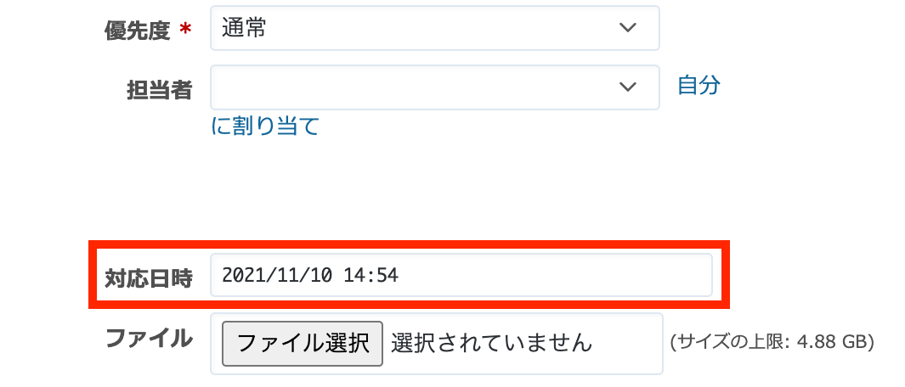

# 新しいチケット画面でカスタムフィールドにデフォルトで現在日時を yyyy/mm/dd hh:mm 形式で表示する

新しいチケット画面でカスタムフィールドにデフォルトで現在日時を yyyy/mm/dd hh:mm 形式で表示します。

対応バージョン: RedMica 1.3.0

## 設定

パスのパターン: `/issues/new`

挿入位置: 全ページのヘッダ

種別: JavaScript

コード:

``` javascript
$(function(){
  function getDate(){
    var now = new Date();
    return (
      now.getFullYear() + "/" +
      ("0" + (now.getMonth() + 1)).slice(-2) + "/" +
      ("0" + now.getDate()).slice(-2) + " " +
      ("0" + now.getHours()).slice(-2) + ":" +
      ("0" + now.getMinutes()).slice(-2)
    );
  }

  $("#issue_custom_field_values_[カスタムフィールドID]").val(getDate());
});
```

**※カスタムフィールドIDは以下の手順で確認して指定してください**

1. 上部メニュー[管理]→[カスタムフィールド]
2. カスタムフィールドの名称をクリックして表示される画面のURLから確認できます

## カスタマイズ結果


