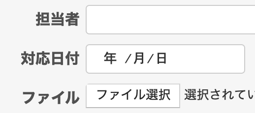
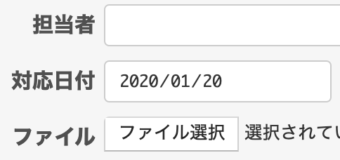

# チケット作成時に日付形式のカスタムフィールドへ現在の日付を表示する

チケット作成画面にて、日付形式のカスタムフィールドにチケットを現在の日付（チケットを作成時の日付）を表示します。

動作確認バージョン：Redmine 6.0 / RedMica 3.2

## 設定

パスのパターン: なし

挿入位置: チケット入力欄の下

種別: JavaScript

コード:

``` javascript
/*カスタムフィールド(日付形式)に今日の日付を表示する*/
$(function(){ 
  $('#issue_custom_field_values_カスタムイールドの値').val(getDate());
  function getDate() {
    var now = new Date();
    now.setDate(now.getDate());
    return yyyymmdd = now.getFullYear() + '-' +
      ("0"+(now.getMonth() + 1)).slice(-2) + '-' +
      ("0"+now.getDate()).slice(-2);
  };
});
```

カスタムフィールドの値は「管理」→「カスタムフィールド」→カスタムフィールドの名称をクリック→URLから確認できます。  
例）`http://localhost:3000/custom_fields/2/edit`

## カスタマイズ結果

「対応日付」がカスタムフィールドです。

### カスタマイズ前


### カスタマイズ後

