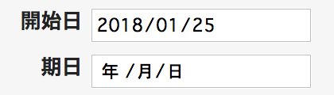
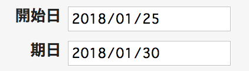

# チケット作成時に作成日から指定した日数後の日付を期日へ表示する

期日をチケット作成日に対応した日数後に設定して表示します。

対応バージョン：Redmine 3.4.11, 4.0.4, 4.1.0

## 設定

パスのパターン: `/issues/new$`

挿入位置: チケット入力欄の下

種別: JavaScript

コード:

``` javascript
/* チケット作成日の7日後の日付を期日に設定する */
$(function() { 
  $('#issue_due_date').val(getDate());
  function getDate() {
    var now = new Date();
    now.setDate(now.getDate() + 7);
    return yyyymmdd = now.getFullYear() + '-' +
      ("0"+(now.getMonth() + 1)).slice(-2) + '-' +
      ("0"+now.getDate()).slice(-2);
  };
});
```

## カスタマイズ結果
### カスタマイズ前


### カスタマイズ後
