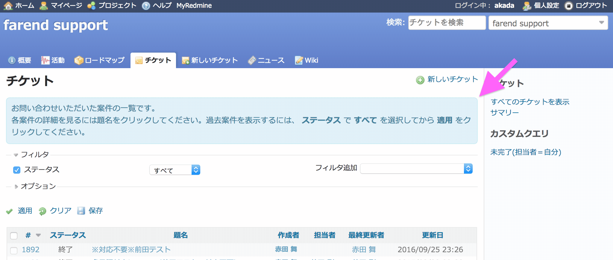
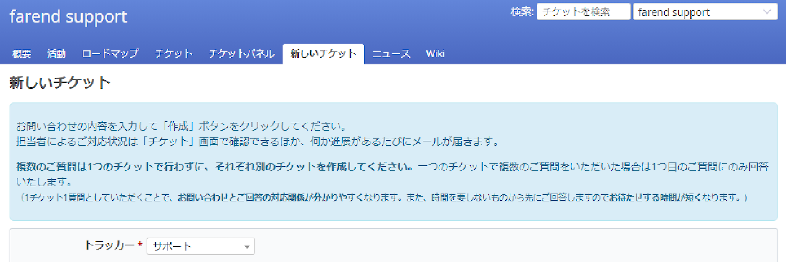

# 各画面に操作ガイダンスを表示する

Redmineの各画面に、操作方法や画面自体の説明を表示することで、Redmineにまだあまりなじんでいない方が操作に戸惑うのを防ぐことができます。

動作確認バージョン：Redmine 6.0 / RedMica 3.2

## 設定

### 設定1: ガイダンス用スタイルを追加

パスのパターン: `/`  
※ `/` は全画面にマッチ

挿入位置: 全ページのヘッダ

種別: CSS

コード:

``` css
/* ガイダンス用スタイル定義 */
.guidance {
  background-color: #d9edf7;
  border: 1px solid #bce8f1;
  border-radius: 6px;
  color: #31708f;
  padding: 8px;
  margin: 10px 0;
}
```

### 設定2: チケット一覧画面でガイダンスを表示

パスのパターン: `/issues\??.*$`  
※ `*/issues` または `*/issues?*` にマッチ (いずれもチケット一覧画面のURL)

挿入位置: 全ページのヘッダ

種別: JavaScript

コード:

``` javascript
/* チケット一覧画面 ガイダンス表示 */
$(function() {
  $("#content>h2:first-of-type").after(
    "<div class='guidance'>お問い合わせいただいた案件の一覧です。<br>" +
    "各案件の詳細を見るには題名をクリックしてください。" +
    "過去案件を表示するには、 <strong>ステータス</strong> で <strong>すべて</strong> を" +
    "選択してから <strong>適用</strong> をクリックしてください。</div>"
  );
});
```

#### カスタマイズ結果




### 設定3: チケット作成画面でガイダンスを表示

パスのパターン: `/issue/new$`

挿入位置: 全ページのヘッダ

種別: JavaScript

コード:

``` javascript
$(function() {
  $("#content>h2:first-of-type").after(
    "<div class='guidance'><p>お問い合わせの内容を入力して「作成」ボタンをクリックしてください。<br>" +
    "担当者によるご対応状況は「チケット」画面で確認できるほか、何か進展があるたびにメールが届きます。</p>" +
    "<p><strong>複数のご質問は1つのチケットで行わずに、それぞれ別のチケットを作成してください。</strong>一つのチケットで複数のご質問をいただいた場合は1つ目のご質問にのみ回答いたします。<br>" +
    "<small>（1チケット1質問としていただくことで、<strong>お問い合わせとご回答の対応関係が分かりやすく</strong>なります。また、時間を要しないものから先にご回答しますので<strong>お待たせする時間が短く</strong>なります。)</small></p></div>"
  );
});
```

#### カスタマイズ結果


