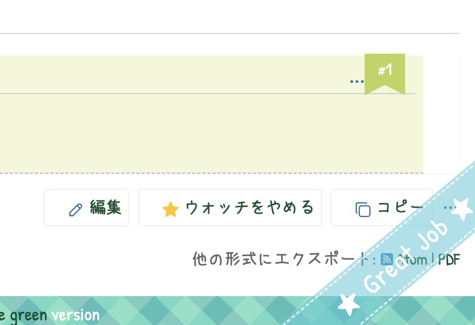
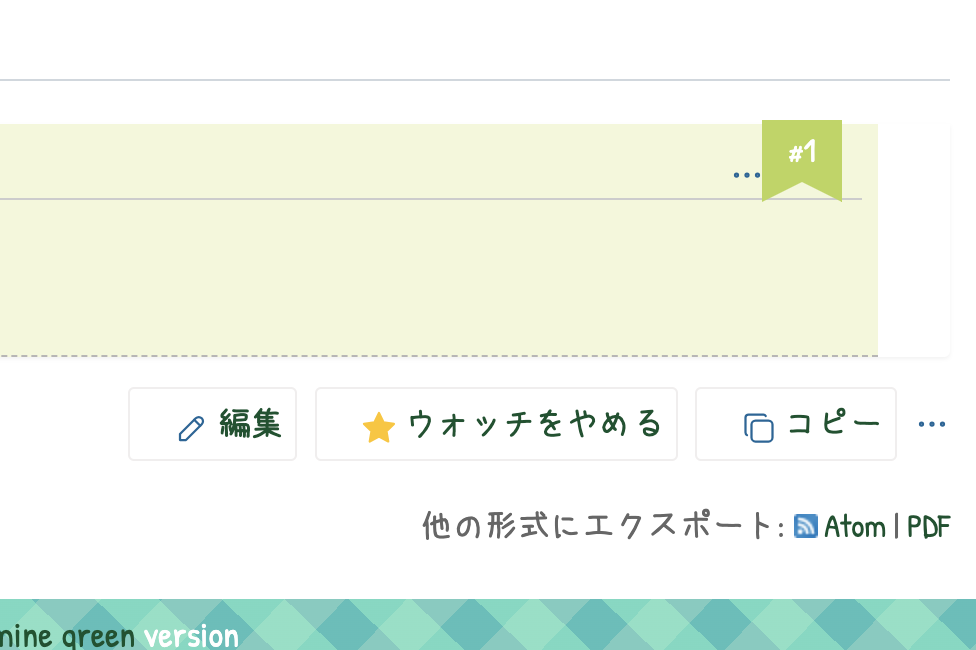

# テーマ「こどもれっどまいん」を使用中に完了チケットの右下で表示される Great Job を非表示にする

動作確認バージョン：Redmine 6.0 / RedMica 3.2

## 設定

パスのパターン: `/issues/[0-9]+`

挿入位置: チケット詳細の下

種別: CSS

コード:

``` css
.ribbon-content {
  display: none;
}
```

## カスタマイズ結果

### カスタマイズ前




### カスタマイズ後


