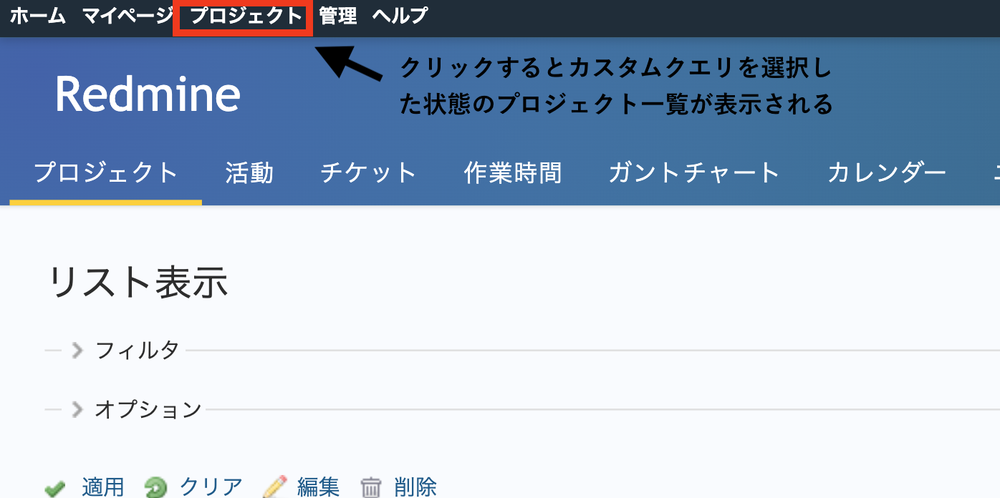

# カスタムクエリが反映されたプロジェクト一覧画面を表示する

Redmine 4.1よりプロジェクト一覧のページにフィルタとオプションが追加され、設定した表示条件をチケット一覧画面と同じようにカスタムクエリとして保存できるようになりました。  
[Redmine.JP Blog：Redmine 4.1 新機能紹介 (3/3) プロジェクト一覧のフィルタとカスタムクエリ](http://blog.redmine.jp/articles/4_1/new-features-p3/#29482)

画面上部のメニューに表示されるプロジェクト一覧へのリンク先を、カスタムクエリを適用したプロジェクト一覧のURLに設定して表示します。

対応バージョン: Redmine 4.1.0

## 設定

パスのパターン: `.*`

挿入位置: 全ページのヘッダ

種別: JavaScript

コード:

``` javascript
$(function(){
  $('div#top-menu a.projects').attr('href', '/projects?query_id=****');
});
```

「****」は表示したいカスタムクエリのIDに書き換えてください。IDはカスタムクエリを表示したURLから調べることができます。  

## カスタマイズ結果




