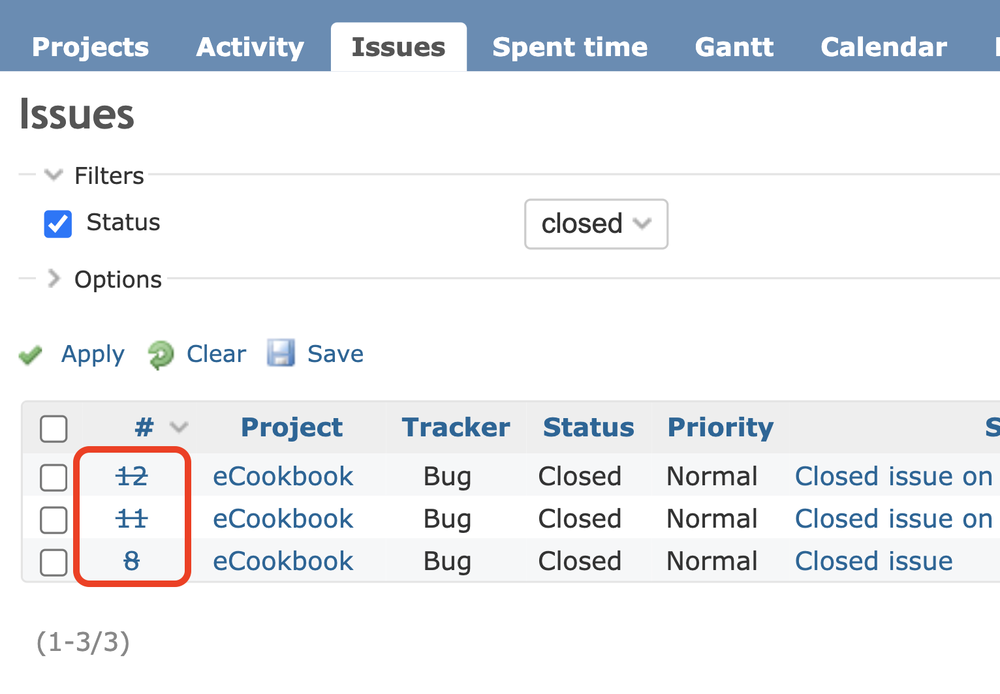

# チケット一覧で完了しているチケットの番号に取り消し線を表示する

チケット一覧画面にて完了しているチケットの番号に取り消し線を表示します。

対応バージョン：Redmine 4.0.9, 4.1.1, 4.2.1

## 設定

パスのパターン: `/issues$`

挿入位置: 全ページのヘッダ

種別: CSS

コード:

``` css
table.list.issues tr.closed td.id a {text-decoration: line-through;}
```
コメント: チケット一覧で完了しているチケットの番号に取り消し線を表示

## カスタマイズ結果

