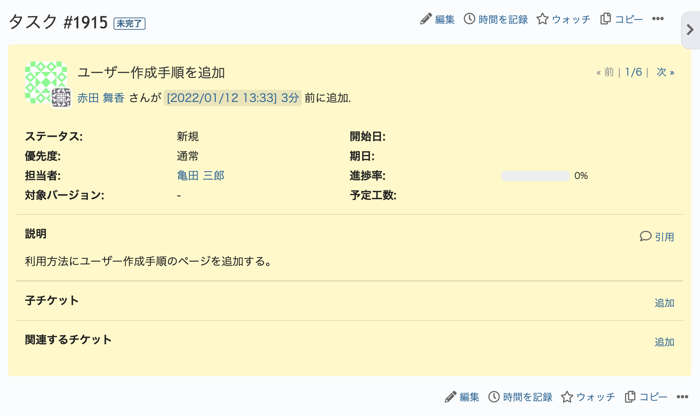
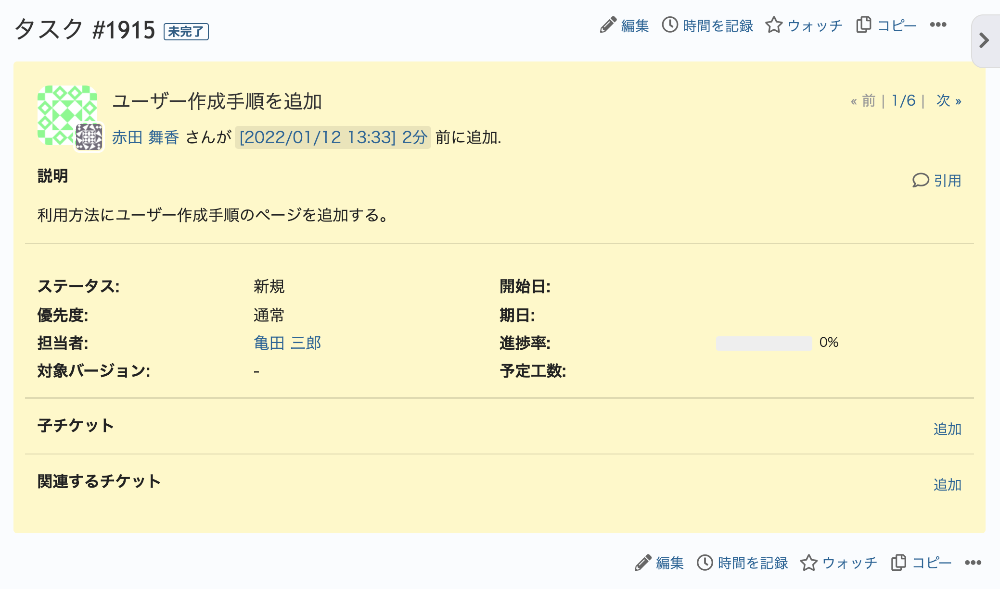

# チケット表示画面で「説明」を上に表示する

チケット表示画面で、ステータス、優先度、担当者などの項目より上に説明を表示します。

対応バージョン：Redmine 4.2.1 / RedMica 2.0.0

## 設定

パスのパターン: `/issues/[0-9]+`

挿入位置: 全ページのヘッダ

種別: JavaScript

コード:

~~~ javascript
$(function(){
  if($("div.issue div.description").length){
    $("div.issue div.attributes").before($("div.issue div.description"));
    $("div.issue div.attributes").before($("div.issue div.attributes + hr"));
  }
});
~~~

## カスタマイズ結果

### カスタマイズ前

### カスタマイズ後

