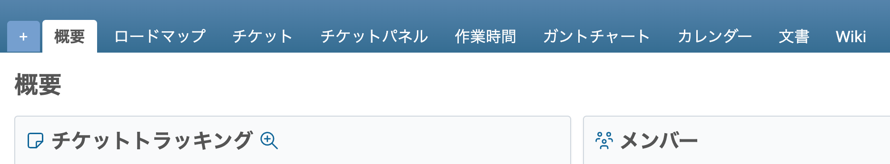

# 「活動」タブを非表示にする

「活動」タブを非表示にします。

> [!Caution]
> 活動タブは非表示になりますが、活動画面のURLを知っている場合、閲覧権限があれば直接アクセス可能です。

対応バージョン：Redmine 6.0 / RedMica 3.2

## 設定

パスのパターン: `.*`

挿入位置: 全ページのヘッダ

種別: CSS

コード:

``` css
#main-menu a.activity {
  display: none !important;
}
```

## カスタマイズ結果

