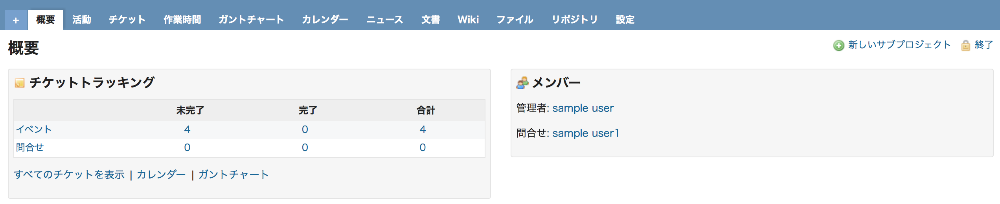
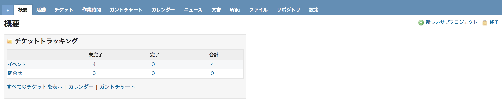

# プロジェクトの概要画面でメンバーを非表示にする

プロジェクトの概要画面にあるメンバーの表示欄を非表示にします。

対応バージョン：Redmine 3.4.11, 4.0.4

## 設定

Path pattern: `/projects/`

Type: JavaScript

Code:

``` javascript
/* プロジェクトの概要画面でメンバー欄を非表示にする */
$(function() {
  $("div.nosidebar div.members.box").remove();
});
``` 

## カスタマイズ結果

### カスタマイズ前



### カスタマイズ後


