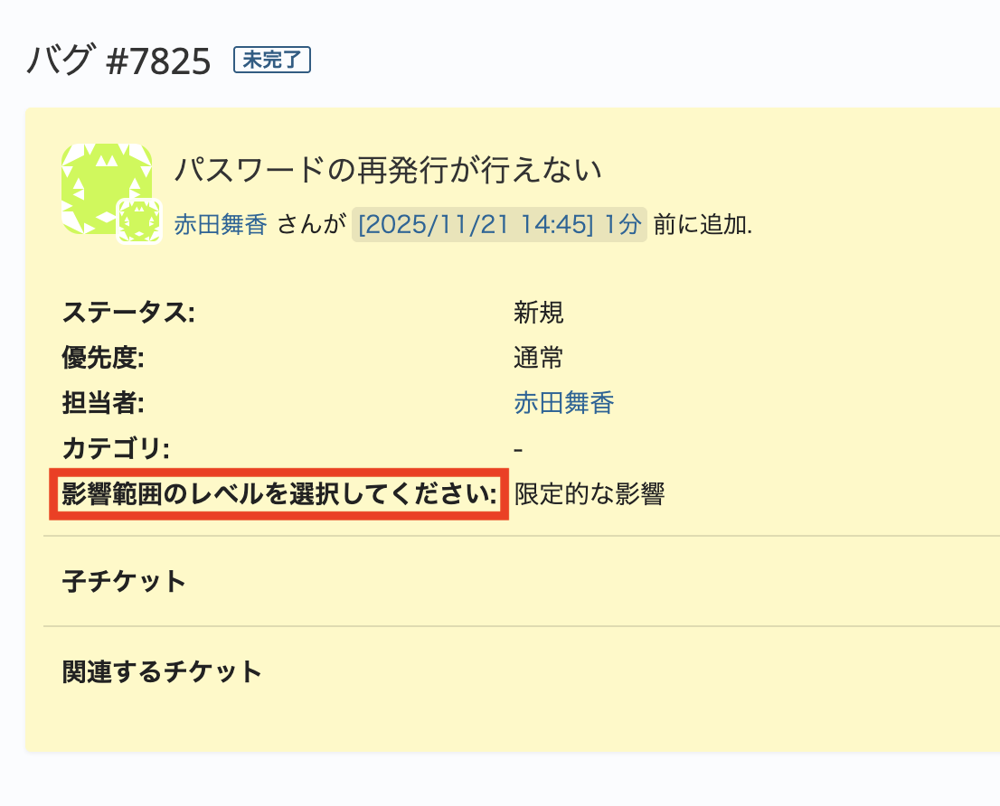

# チケット表示画面で項目名の表示幅を変更する

チケット表示画面にて項目名を指定の幅に変更します。  
項目名が長く折り返されて表示される場合に、任意の幅を設定して表示幅を調整できます。

動作確認バージョン： RedMica 3.2


## 設定

パスのパターン: `/issues/[0-9]+$`

挿入位置: 全ページのヘッダ

種別: CSS

コード:

``` css
div.issue .attributes .attribute .tabular .label{
  width: 200px;
}
```

## カスタマイズ結果

### カスタマイズ前


### カスタマイズ後



