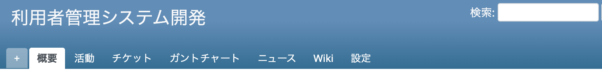
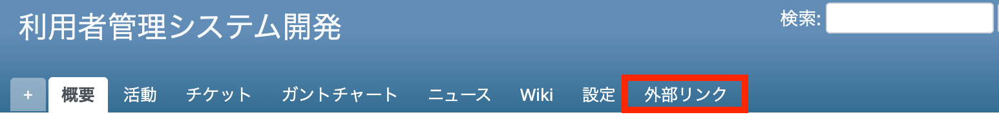

# プロジェクトメニューの最後に外部リンクを追加する

チケット、ガントチャートなどが並ぶプロジェクトメニューの一番右（最後）に、外部サイトへのリンクを追加します。リンクをクリックすると指定した外部リンク先へ遷移します。

動作確認バージョン：Redmine 6.1 / RedMica 4.0

## 設定

パスのパターン: なし

挿入位置: 全ページのヘッダ

種別: JavaScript

コード:

~~~ javascript
$(function(){
  $("#main-menu ul").append(
    '<li><a href="https://example.com" target="_blank" rel="noopener">外部リンク</a></li>'
  );
});
~~~

## カスタマイズ結果

### カスタマイズ前

### カスタマイズ後

