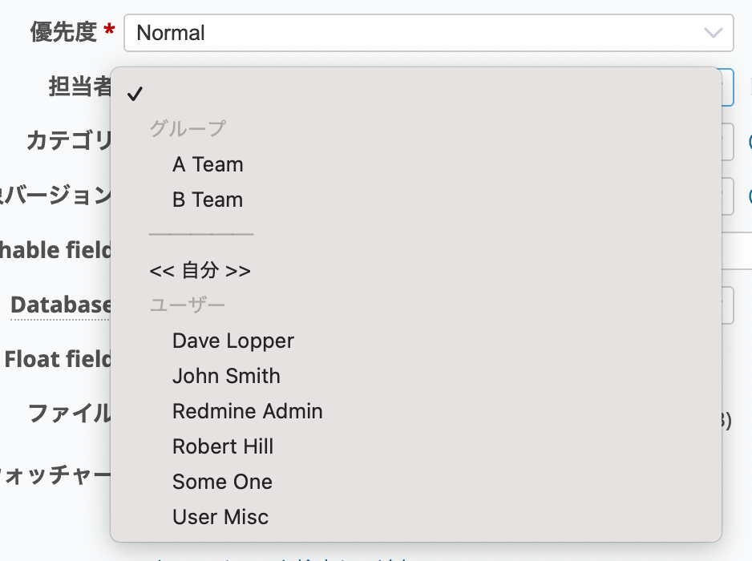

# 「担当者」ドロップダウンでグループをユーザーより前に表示する

「グループへのチケット割り当てを許可」（「管理」→「設定」→「チケットトラッキング」）をONにすると、チケットの担当者にユーザーだけではなくグループも設定できます。

このカスタマイズでは、担当者のドロップダウンリストボックスでユーザーよりもグループを先に表示するようにします。

対応バージョン：RedMica 2.2

## 設定

パスのパターン: `/`

挿入位置: チケット入力欄の下

種別: JavaScript

コード:

~~~ javascript
$(function() {
  $("select#issue_assigned_to_id").each(function(){
    $(this).children("optgroup").insertAfter($(this).children(":first"));
    $(this).children("optgroup:last").after("<option value='' disabled=true>─────</option>");
  });
});
~~~

## カスタマイズ結果

### カスタマイズ前

### カスタマイズ後

