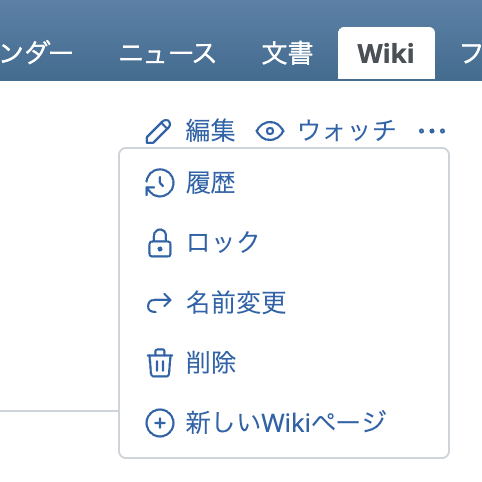
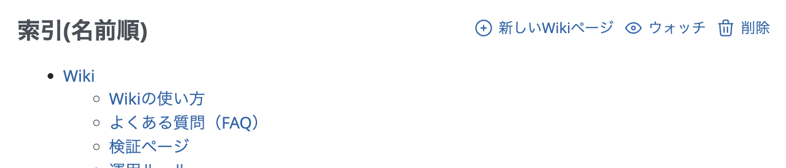
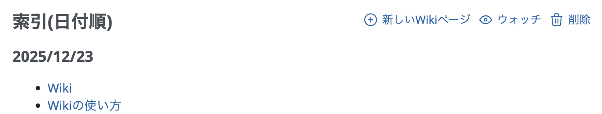
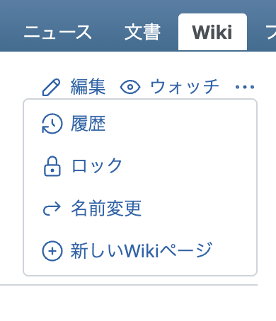
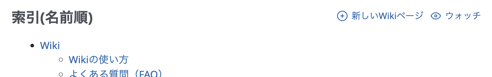
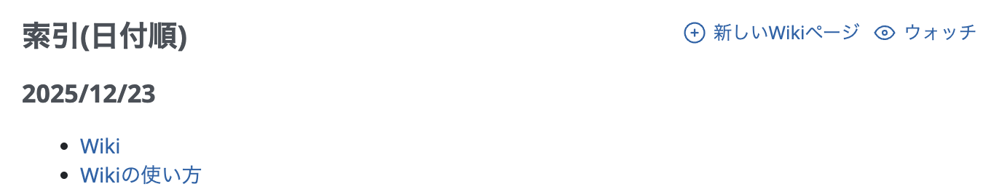

# Wikiの削除ボタンを非表示にする

システム権限を持つユーザーに対しては、「Wikiページの削除」権限の設定は反映されません。システム管理者権限を持つユーザーがログインした場合でも、Wikiページの削除が行えないよう削除ボタンを非表示にします。

動作確認バージョン：Redmine 6.1 / RedMica 4.0

## 設定

### 設定1: 「⋯」をクリックして表示されるメニューから「削除」を非表示にする

パスのパターン: `^/projects/[^/]+/wiki(?!/(index|date_index)$)`

挿入位置: 全ページのヘッダ

種別: CSS

コード:

~~~ css
#content .drdn-content a.icon-del {
  display: none;
}
~~~

### 設定2: 索引(名前順)・索引(日付順)で「削除」を非表示にする

パスのパターン: `^/projects/[^/]+/wiki/(index|date_index)$`

挿入位置: 全ページのヘッダ

種別: CSS

コード:

~~~ css
#content .contextual a.icon-del {
  display: none;
}
~~~

## カスタマイズ結果

### カスタマイズ前

|設定1|設定2: 索引(名前順)|設定2: 索引(日付順)|
|---|---|---|
||||

### カスタマイズ後

|設定1|設定2: 索引(名前順)|設定2: 索引(日付順)|
|---|---|---|
||||
