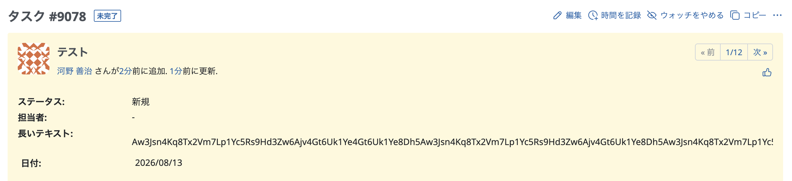
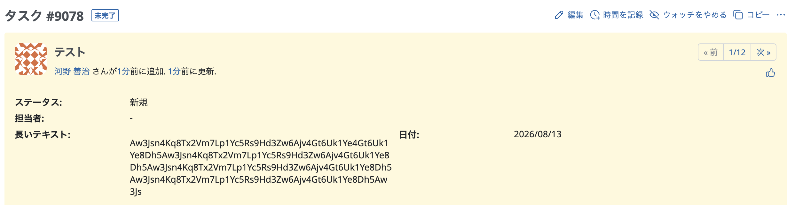

# チケット表示画面で「長いテキスト」形式カスタムフィールドの値を折り返して表示する

「長いテキスト」形式のカスタムフィールドに英字や数字が連続する長い文字列が入力されていると、項目の表示幅が広がり、値が見切れることがあります。  
このカスタマイズでは、CSS の overflow-wrap プロパティを適用し、長い文字列を折り返して表示します。

カスタムフィールドのIDは、カスタムフィールドの設定画面のURLから調べることができます。  
カスタムフィールドのIDの確認方法：トップメニュー「管理」→ 「カスタムフィールド」→ 長いテキストのカスタムフィールドをクリック → URLを確認  
例）URLが`https://example.cloud.redmine.jp/custom_fields/111/edit`の場合、111がカスタムフィールドのIDです。`div.text_cf.cf_111 .value p`のようにコードにIDを追加します。


動作確認バージョン： RedMica 4.1


## 設定

パスのパターン: `/issues/[0-9]+$`

挿入位置: 全ページのヘッダ

種別: CSS

コード:

``` css
div.text_cf.cf_カスタムフィールドのID .value p {
  overflow-wrap: anywhere;
}
```

## カスタマイズ結果

### カスタマイズ前



### カスタマイズ後



