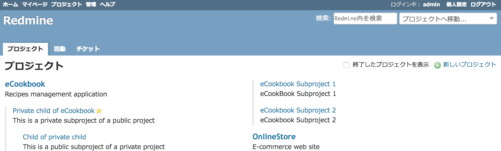

# 「プロジェクト」画面から「ガントチャート」「カレンダー」などのメニューを非表示にする

「プロジェクト」画面に表示されている、「ガントチャート」「カレンダー」などのメニューを非表示にします。

対応バージョン：Redmine 3.4.11, 4.0.4, 4.1.0 / RedMica 1.2.0

## 設定

パスのパターン: `/projects$`

挿入位置: 全ページのヘッダ

種別: CSS

コード:

``` css
/* 「プロジェクト」画面のメインメニューから「プロジェクト」「活動」「チケット」以外のメニューを消す */
#main-menu a.time-entries,
#main-menu a.gantt,
#main-menu a.calendar,
#main-menu a.news {
  display: none;
}
```

## カスタマイズ結果

### カスタマイズ前


### カスタマイズ後


