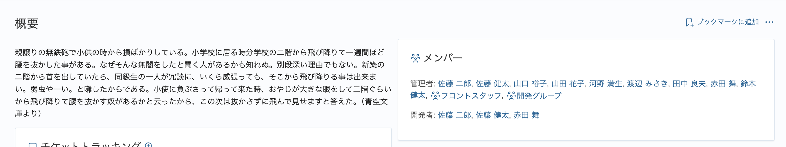
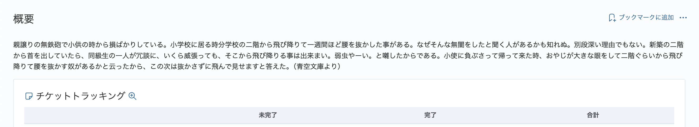

# プロジェクトの概要画面で説明を横幅いっぱいに表示する

プロジェクトの概要画面ではの説明（設定→プロジェクトタブの「説明」）を横幅いっぱいに表示します。
**※このカスタマイズを追加するとメンバーや最新ニュース、サブプロジェクトが説明の下に表示されるようになります。**

対応バージョン：RedMica 3.1

## 設定

パスのパターン: `/projects`

挿入位置: 全ページのヘッダ

種別: CSS

コード:

``` css
/* プロジェクトの概要画面で説明を横幅いっぱいに表示する */
#content div.splitcontent {
 display: inherit;
}
```

## カスタマイズ結果

#### カスタマイズ前



#### カスタマイズ後

