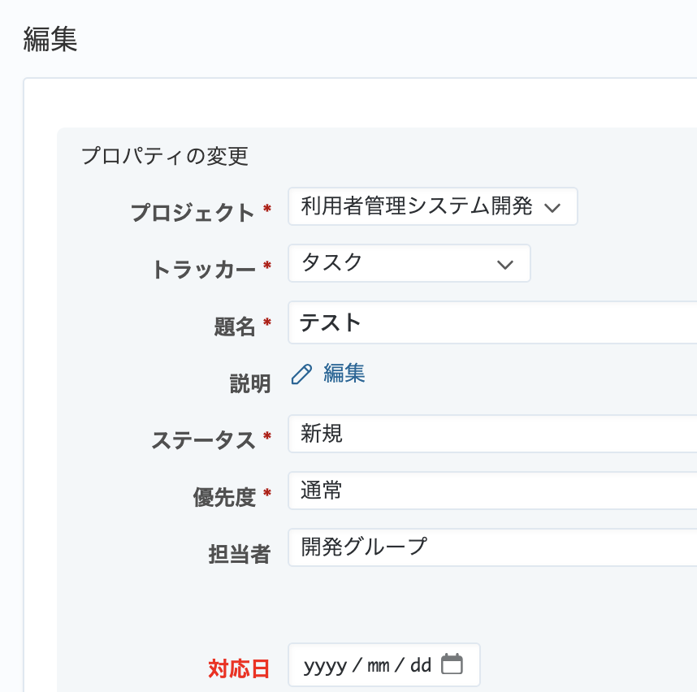

# チケットの編集画面でカスタムフィールドの名称の文字色を変更する

カスタムフィールドの名称の文字色を変更して表示します。

動作確認バージョン：Redmine 6.0 / RedMica 3.2

## 設定

パスのパターン: `/issues/`

挿入位置: 全ページのヘッダ

種別: CSS

コード:

``` css
/* チケットの編集画面でカスタムフィールドの名称の文字色を変更する */
.edit_issue .tabular label:has(+ .cf_カスタムフィールドのID){
  color: red;
}
```

## カスタマイズ結果


