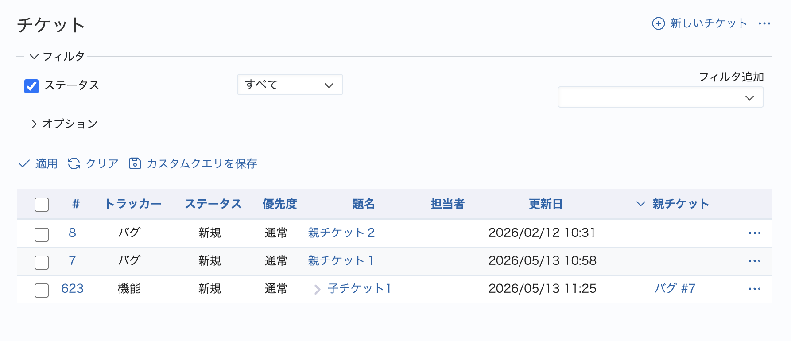
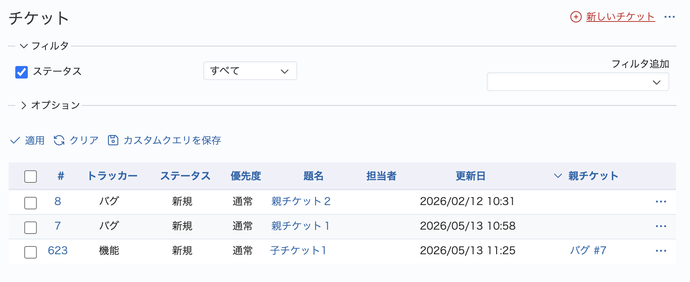

# チケット一覧でインシデント表示を無効化する

親子関係のあるチケットを、親チケットをキーとしてソートした場合、子チケットはスタイル設定によりインシデント表示されます。スタイル設定を無効化してチケット一覧をフラットに表示します。

動作確認バージョン：Redmine 6.1 / RedMica 4.0

## 設定

パスのパターン: `/(.*/)?issues`  

挿入位置: 全ページのヘッダ

種別: CSS

コード:

``` css
tr[class*="idnt"] :is(td.subject, td.name) {
    padding-inline-start: unset !important;
    padding-left: unset !important;
    background-image: none !important;
}
```

## カスタマイズ結果

### カスタマイズ前



### カスタマイズ後


