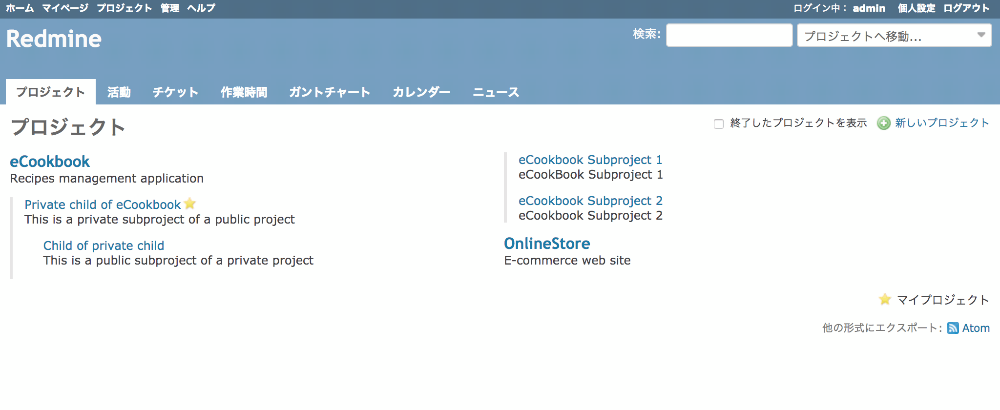
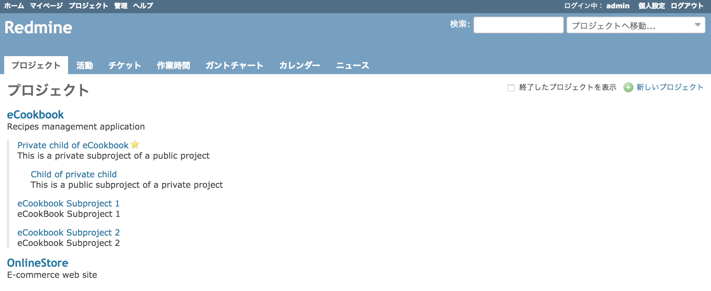
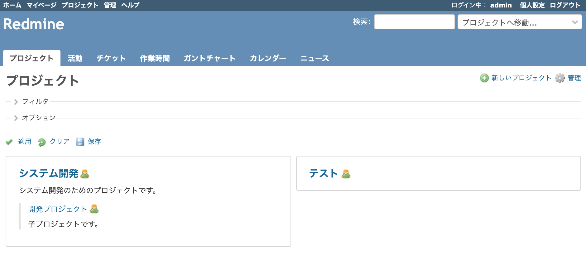
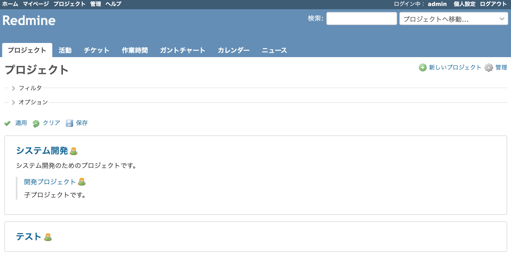

# プロジェクト画面の段組みを解除して1段で表示する

プロジェクトの一覧が、Redmine 3.4.0より段組み表示されるようになりました。これを従来通りの1段の表示に戻します。

対応バージョン：Redmine 3.4.11, 4.0.4, 4.1.0

## 設定

パスのパターン: `/projects$`

挿入位置: 全ページのヘッダ

種別: StyleSheet

コード:

``` css
/* プロジェクト画面の段組みを解除して1段で表示する */
#projects-index {
  column-count: 1;
  column-width: auto;
  -webkit-column-count: 1;
  -webkit-column-width: auto;
  -moz-column-count: 1;
  -moz-column-width: auto;
}
```

## カスタマイズ結果

#### カスタマイズ前



#### カスタマイズ後



### Redmine 3.4.8以降

#### カスタマイズ前



#### カスタマイズ後


