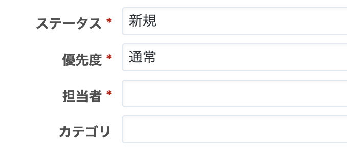
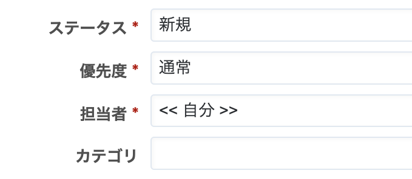

# チケット作成画面でチケットを作成しているユーザーを「担当者」に表示する

チケットを作成しているユーザーが担当者として選択された状態でチケット作成画面を表示します。

対応バージョン：RedMica 2.3

## 設定

パスのパターン: `/issues/new$`

挿入位置: チケット入力欄の下

種別: JavaScript

コード:

~~~ javascript
$(function(){
  $('#issue_assigned_to_id').val($('#issue_assigned_to_id option:contains("自分")').val());
  $('#issue_assigned_to_id').change();
});
~~~

## カスタマイズ結果

### カスタマイズ前

### カスタマイズ後

