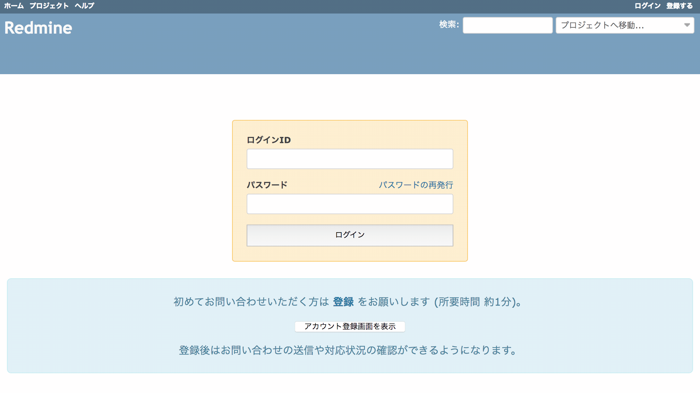

# ログイン画面にアカウント登録を促すメッセージを表示する

「管理」→「設定」画面の「認証」タブで「ユーザーによるアカウント登録」を有効にしている場合、ログイン画面の右上に表示されている「登録する」をクリックするとユーザーが自分でアカウントを登録することができます。しかし、Redmineになじみのない人にとっては「登録する」は見つけにくいことが有ります。

ログイン画面の下に登録を促すメッセージを表示を表示すると、Redmineに不慣れな人をアカウント登録に誘導することができます。

対応バージョン：Redmine 3.4.11, 4.0.4

## 設定

StylesheetとJavaScriptの2つを設定します。

### StyleSheet

Path Pattern: `/login\??.*$`<br>
※ `/login` または `/login?` にマッチ (いずれもログイン画面のURL)

Type: StyleSheet

Code:

``` css
/* メッセージ用スタイル定義 */
.support-guidance-login {
  text-align: center;
  font-size: 15px;
  background-color: #d9edf7;
  border: 1px solid #bce8f1;
  border-radius: 6px;
  color: #31708f;
  padding: 8px;
  margin: 10px 0;
}
```

### JavaScript

Path Pattern: `/login\??.*$`<br>
※ `/login` または `/login?` にマッチ (いずれもログイン画面のURL)

Type: JavaScript

Code:

``` javascript
/* ログイン画面 アカウント登録を促すメッセージ表示 */
$(function() {
  $('#login-form').after(
    '<div class="support-guidance-login">' +
    '  <p>初めてお問い合わせいただく方は <a href="account/register/"><strong>登録</strong></a> をお願いします (所要時間 約1分)。<p>' +
    '  <p><a href="account/register/"><button type="button"><span >アカウント登録画面を表示</span></button></a></p>' +
    '  <p>登録後はお問い合わせの送信や対応状況の確認ができるようになります。</p>' +
    '</div>'
  );
});
```

## カスタマイズ結果


